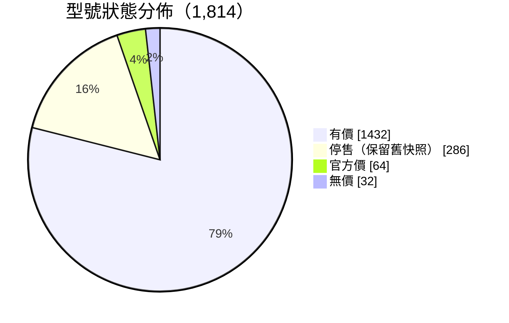
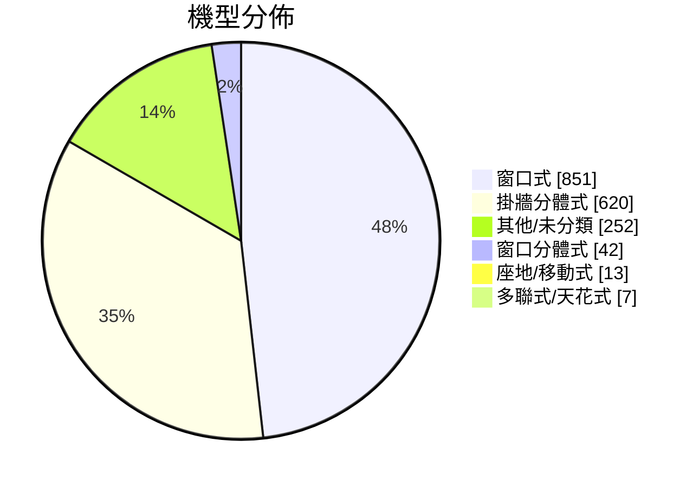
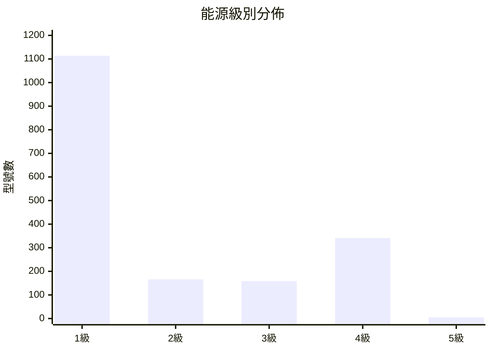
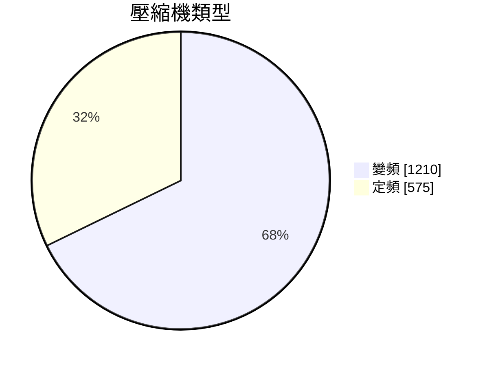
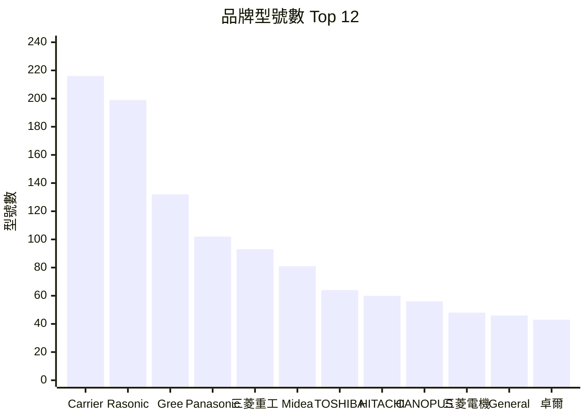
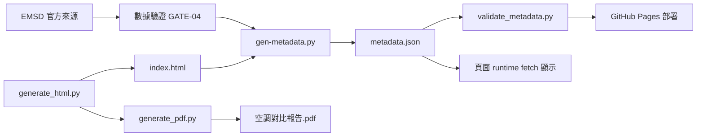
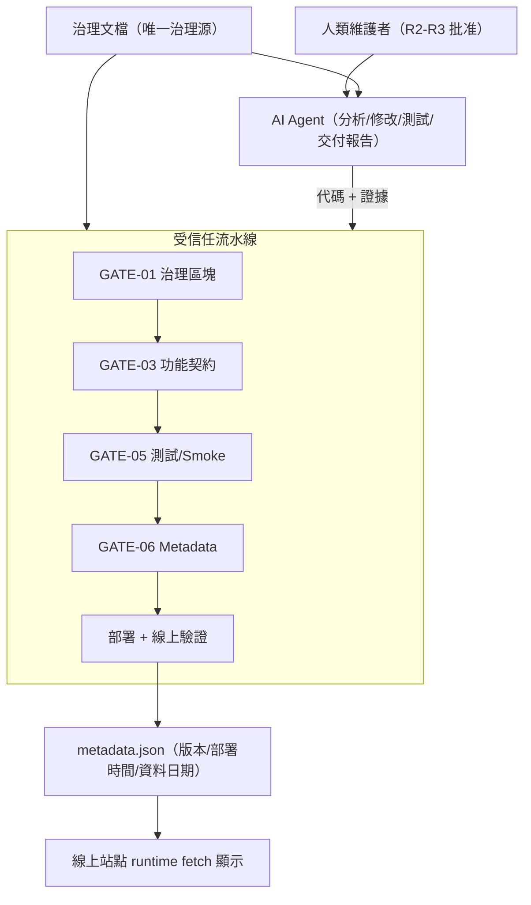

# ❄️ 香港空調對比報告（網頁版） 

> 香港市場空調（窗口式 / 分體式 / 流動式；淨冷/冷暖、定頻/變頻）全面對比
> **能源級別、雪種、年耗電已用機電署 EMSD 官方資料庫（1,927 型號）全量核實**
> **220 個型號已直接經品牌官網/官方網店/總代理逐型號核實（2026-08-15）**
> 🎨 **Blue Fantasy 藍色幻想 skin**（dsh-web-ui 皮膚；只套皮膚，其他插件不加）
> 📌 **現況（2026-08-26）**：v1.2.8——治理落地 + PDF 導出 + BigGo 官方認證（免登入通道已關閉，改用免費 client credentials，見 `docs/DECISIONS.md` D10）；本地全量驗證 742 型號有價

## 🚀 立即使用

**線上版**：<https://calvinlau1012.github.io/aircon-compare/> （GitHub Pages）

**離線版**：下載 [`index.html`](index.html)，直接在瀏覽器打開（單一檔案，可 email / WhatsApp 轉發）。

## ✨ 功能

- ⚖️ **互動比較器**：勾選 2 個或以上型號，即時彈出 18 項屬性對比表（自動高亮最平/最慳電/最高 CSPF）
- 🔍 搜尋（品牌/型號）+ 自由篩選標籤（品牌、機型、匹數、能源、價位、停售狀態）+ 排序（價格 / 能源 / 年耗電 / CSPF）
- 🛒 1,848 個型號附價格快照（BigGo 2026-08-16 主力 + Price 舊快照後備），點擊 🔍 直接在你的瀏覽器用 Google 搜最新價
- 📱 手機 / 平板 / 桌面全響應式（表格可橫向捲動）
- 🌙 深色模式自動跟隨系統，並已修正目錄連結／表格 hover／code／引用／卡片／按鈕等對比度
- 📊 完整報告：定頻 vs 變頻、統合總表、官方驗證、能源分析、深度分析、排名、推薦、價格驗證、論壇討論精華

## 📊 數據

| 項目 | 數量 |
| ------ | ------ |
| 收錄型號 | 1,854（核心 29 + EMSD 全量 1,825） |
| 有價格型號 | BigGo 742（2026-08-26 本地全量實抓·官方認證）+ Price 舊快照 1,847（後備） |
| 淘汰黑名單 | 1,095（2026-08-26 全量復核；復活 8 個重有市售報價型號） |
| BigGo 香港格價型號 | 742（官方 JSON API + 免費認證；主力價錢源） |
| PricesAPI 核心驗收型號 | 29（選用驗收/後備，每月免費額度內） |
| 有尺寸型號 | 1,676 |
| EMSD 官方核實型號 | 1,927（全量） |
| 品牌官網核實型號 | 220（8 品牌） |
| 對比屬性 | 18 項 |

### 📈 數據統計（2026-08-26 全量實抓後）

#### 狀態分佈（比較器新標籤）



#### 機型分佈



#### 能源級別



#### 類型與匹數



| 匹數 | 型號數 |
| --- | --- |
| 1 匹 | 486 |
| 1.5 匹 | 432 |
| 2 匹 | 420 |
| 2.5 匹+ | 249 |
| 3/4 匹 | 198 |

#### 價位分佈（BigGo 742 個有價型號）

| 價位 | 型號數 |
| --- | --- |
| $2,000 以下 | 69 |
| $2,000-3,000 | 177 |
| $3,000-4,000 | 148 |
| $4,000-5,000 | 112 |
| $5,000 以上 | 236 |

#### 品牌分佈（Top 12）



> 🎨 角色形象：whale-girl 鯨魚娘（寵物皮膚：[zhu1090093659/dsh-web-ui](https://github.com/zhu1090093659/dsh-web-ui) · 介紹：[linux.do](https://linux.do/t/topic/2751323)）
> 🙏 **特別鳴謝**：Blue Fantasy 皮膚原作 **powerdog996（DreamSkin 社區）**、dsh-web-ui 適配與鯨魚娘素材提供者 **zhu1090093659**，以及 linux.do 介紹帖作者

## 🏭 品牌官網核實（2026-08-15）

| 品牌 | 官方渠道 | 型號數 |
| ------ | --------- | ------- |
| Carrier 開利 / Canopus 肯特 | century-carrier.com 世紀開利 | 79 |
| Rasonic 樂信 | shew.com.hk 信興 + rasonicshop.hk 官方網店 | 50 |
| Panasonic 樂聲 | panasonic.hk + 信興 eShop | 25 |
| COMFEE | feelcomfee.com | 18 |
| GENERAL 珍寶 | general-aircon.com 總代理（第一電業） | 16 |
| HITACHI 日立 | hitachi-homeappliances.com.hk | 16 |
| Midea 美的 | mideahk.com | 12 |
| FROSTAR 霜牌 | rasonicshop.hk（信興姊妹品牌） | 4 |

> ⚠️ Gree/TOSOT 代理官網無窗口機產品頁 → 維持 EMSD/Price 雙源並標註「待查」，**絕不編造**。

## 🔄 自動更新（新機偵測）

- **排程**：GitHub Actions 每日 00:30（香港時間）輕量偵測 EMSD；**有新機才觸發更新**（官網核實分兩日分批進行），沒有新機就不更新內容
- **價錢快照**：**BigGo 官方 JSON API**（`api.biggo.com`，多商戶報價，與 BigGo MCP Server 同源）+ PricesAPI 核心 29 驗收/後備 + Price.com.hk 舊快照；有新機時每月最多更新一次（分 7 日分批；現時批次進度 2/7）；點擊 🔍 在瀏覽器用 Google 搜最新價
- **新機偵測**：比較 EMSD 官方資料庫新舊型號，新上市型號自動入庫並在網頁「🆕 最近新上市」顯示
- **價錢策略**：價錢快照以 BigGo 2026-08-16 實抓為主（不頻繁更新，僅供參考）；規格以 EMSD + 品牌官網為準
- **安全**：BigGo 主力源免憑證；PricesAPI key 只放 GitHub Actions Secrets（`PRICESAPI_API_KEY`），核心 29 驗收用 repo Variables `PRICESAPI_CORE_CHECK=1` 選用；權限只限 `contents: write`；Action 版本固定（@v7/@v7，Node 24）；設 concurrency 防重疊
- **部署顯示**：每次成功更新會記錄香港時間 `last_deploy`，網頁 hero 顯示「✅ 成功更新：YYYY-MM-DD HH:MM」
- **淘汰機制**：`model_blacklist.json` 自動記錄連續多次「BigGo 無市售報價」的型號；一經確認就停止更新、保留舊快照，並在報告標註「🚫 已停售/淘汰」
- **穩定**：抓取後經「數據驗證閘門」(`validate_data.py`) 檢查數量在安全範圍——不合格就不提交，保住現有數據；每次成功提交 = 可回溯快照，損壞可一鍵還原
- 亦可在 GitHub Actions 頁面手動觸發（workflow_dispatch）

## 🏛️ 治理標準

項目依 `docs/AIRCON_COMPARE_GOVERNANCE.md`（唯一治理源）運作，版本/部署時間/資料日期全部由流水線生成的 `metadata.json` 提供。

### CI 門禁（全部 Block 級）

| Gate | 階段 | 檢查內容 |
| --- | --- | --- |
| GATE-01 | 治理靜態 | 六個規範區塊嚴格提取 + JSON 解析 |
| GATE-03 | 功能契約 | 功能註冊表 Schema + 15 項 required 測試綁定 |
| GATE-04 | 數據 | EMSD 行數 / 價格 / 規格安全範圍 |
| GATE-05 | 測試/Smoke | 單元測試 + 瀏覽器核心路徑 smoke |
| GATE-06 | Metadata | `metadata.json` 生成（deployTime UTC 自動）+ Schema 驗證 |

### Metadata 鏈路



### 功能註冊表（15 項 required，全部有測試綁定）

| 類別 | 功能 |
| --- | --- |
| core | search · filter · sort · compare · ranking · recommendation |
| ui | comparison-modal · responsive |
| data | emsd-verification |
| report | pdf-export |
| operations | version-display · last-deploy · dataset-update · build-metadata · github-pages-deploy |

### 決策記錄

人類決策項與因技術限制導致的方案轉向，見 `docs/DECISIONS.md`（含背景、選項、決策與原因）。

### 治理範疇一覽（完整版見治理文檔）

| 範疇 | 治理文檔章節 | 現況 |
| --- | --- | --- |
| AI Governance | §0 執行契約 · §3 執行流程 · §14 交付報告 | ✅ 已落地 |
| Architecture Governance | §1 單一事實源 · §16 落地結構 | ✅ 已落地 |
| Feature Governance | §5 功能註冊表（15 項 required） | ✅ 已落地 |
| DevOps Governance | §11 部署後驗證 · §17 核對表 | ✅ 已落地 |
| CI/CD Governance | §9 門禁 GATE-01~09 | ✅ GATE-01/03/05/06 已上 CI |
| Version Governance | §8.1 SemVer + `models_data.VERSION` 單一來源 | ✅ 已落地 |
| Release Governance | §8.3 發布資產 · §17 | ✅ 已落地 |
| Rollback Governance | §7.3 回滾元數據 · §11.3 四級回滾 · §11.4 七步流程 | ✅ 已落地 |
| Monitoring Governance | §11.2 最低監控 | ✅ 規範就緒 |
| AI Agent Governance | §0.3 任務模式 · §4 角色/風險/批准 · §4.4 權限模型 | ✅ 已落地 |

### DevOps 最終目標

| 目標 | 狀態 | 機制 |
| --- | --- | --- |
| 每次部署自動產生版本資訊 | ✅ | GATE-06 `metadata.json.version` |
| 每次部署自動產生最後部署時間 | ✅ | `metadata.json.deployTime`（HKT 顯示） |
| EMSD 更新自動檢測 | ✅ | 每日 00:30 HKT cron + 新機偵測 |
| Feature 不得被 AI 誤刪 | ✅ | 功能註冊表 + GATE-03 feature-check |
| 所有重要功能有 Smoke Test | ✅ | GATE-05 瀏覽器核心路徑 5 項 |
| 所有變更有 Changelog | ✅ | `CHANGELOG.md` + 各文檔更新日誌 |
| 支援多人協作 | ⚠️ | git + concurrency group；PR 審批流程待完善 |
| 支援多 AI 協作 | ✅ | 治理文檔面向人類 + AI + CI 三類執行者 |
| 支援未來 v2.0 平台化 | ⚠️ | §16 目標結構已定義；未啟動 |

### 回滾與版本策略（摘要）

- **版本**：SemVer；版本號唯一手動來源 `models_data.py` 的 `VERSION`；部署事實一律由流水線 `metadata.json` 提供
- **回滾**：四級（L1 代碼修復 → L2 應用回滾 → L3 數據快照 → L4 全站）；目標必須由 tag/commit/發布摘要/快照 ID 唯一確定；每次成功提交 = 可回溯快照

### 治理架構圖（完整四圖見治理文檔 §1.1.1/§3.5/§4.4/§9.1.1）



## 🔧 自行重建

```bash

python generate_html.py        # 讀取 .md + JSON 資料庫 → 生成空調對比報告.html
copy 空調對比報告.html index.html   # 同步 GitHub Pages 入口
python -m pytest              # 跑單元測試（先 pip install -r requirements-dev.txt）

```

資料庫重新抓取（可選）：

```bash

python fetch_biggo.py --price-batch   # BigGo 主力價錢批次（731 型號；與 MCP Server 同源）
export PRICESAPI_API_KEY=pricesapi_xxx   # 或在 GitHub Actions Secrets 設定
python fetch_pricesapi.py --core   # PricesAPI 核心 29 驗收/後備（不跑批次）
python fetch_prices.py         # Price.com.hk 舊快照（1,847 型號，可選；已被 Cloudflare 封）
python fetch_official.py       # Panasonic/HITACHI/COMFEE 官網規格
python fetch_shew.py           # 信興官網 Rasonic 規格
python fetch_carrier.py        # 世紀開利 Carrier/Canopus 規格
python fetch_general.py        # 珍寶總代理規格
python fetch_rasonic.py        # 樂信官方網店價格

```

## 📁 專案檔案

| 檔案 | 說明 |
| ------ | ------ |
| `index.html` | 網頁版報告（self-contained，無外部依賴；`空調對比報告.html` 為本機生成物，不入庫） |
| `空調對比報告.md` | Markdown 報告全文 |
| `需求摘要.md` | 需求元文件 |
| `generate_html.py` | 網頁生成器（md + JSON → HTML） |
| `models_data.py` | 核心 29 型號資料庫（`MODELS` / `VERSION` 單一來源，供 generate_html / fetch_* 共用） |
| `crawl_utils.py` | 共用工具（誠實 UA / 型號規範化 / JSON 讀寫 / HTML 轉字 / 退避重試 / SSL context） |
| `price_utils.py` | 價錢過濾共用工具（冷氣關鍵詞 / 配件排除 / 價格範圍格式化） |
| `batch_utils.py` | 價錢批次 meta / 進度共用工具（每月一次分 7 日、冷卻期、打卡、部署時間） |
| `model_lifecycle.py` | 型號淘汰/黑名單管理（連續無市售報價自動停止更新） |
| `model_blacklist.json` / `model_status.json` | 淘汰黑名單 / 追蹤記錄 |
| `validate_data.py` | 數據驗證閘門（自動更新防壞數據） |
| `tests/` · `requirements-dev.txt` | 單元測試 + 開發依賴（pytest） |
| `emsd_空調能源標籤.csv` | EMSD 官方資料庫快照（1,927 型號） |
| `prices.json` / `specs_emsd.json` | Price 舊快照 / 規格資料庫（後備） |
| `biggo_prices.json` | BigGo 官方 JSON API 價錢快照（731 型號，主力價錢源） |
| `pricesapi_prices.json` | PricesAPI 核心 29 驗收快照（後備，需 API key） |
| `whale_girl.webp` / `whale-girl.ico` | whale-girl 鯨魚娘角色立繪（官方 sprite 高清提取 WebP + 用戶原始 ICO） |
| `blue_fantasy_art.txt` | Blue Fantasy skin 背景 whale art（data URI，網站內嵌用） |
| `official_specs.json` 等 7 個 `*_official.json` | 品牌官網核實數據 |
| `fetch_*.py` | 各數據源抓取腳本（EMSD/PricesAPI/Price/官網） |

## 🧭 開發困難與決策（紀錄）

> 完整決策記錄（含人類決策項、背景、選項、原因）見 `docs/DECISIONS.md`。以下為重點摘要。

### 1. 價錢數據源被封

- **困難**：Price.com.hk 全站被 Cloudflare「Just a moment…」質疑頁攔截——urllib、Playwright headless、有頭瀏覽器全部被擋；確認不是限流（等冷卻無效），而是硬性封鎖
- **決策**：**不用代理繞過**（保持誠實爬蟲）；探測十多個來源後，改用 **BigGo 香港格價**作主價源（多商戶報價，性質與 Price.com.hk 一致，urllib 直連無 Cloudflare）
- **升級**：改用 BigGo **官方公開 JSON API**（`api.biggo.com/api/v1/spa/search/{型號}/product`，`site=biggo.hk`、`region=hk`），不再解析 HTML；商品搜索無需憑證（`client_id/client_secret` 僅規格搜索用）；修復分體機型號斜杠（`/`）未編碼導致 403 的 bug
- **再升級（2026-08-16）**：曾試用 **PricesAPI**（`api.pricesapi.io`，香港市場、免費 1,000 calls/月）；實測 BigGo MCP Server 後，確定主力用回 BigGo，PricesAPI 只保留核心 29 驗收/後備
- **限流轉向（2026-08-26）**：GitHub Actions IP 被 BigGo 網頁版限流 → 經人類決策先採純快照 → 發現官方 JSON API（不同主機）後轉向 API 方案（見 DECISIONS.md D1-D3）

### 2. Gemini 人手查價全量失敗

- **困難**：Web 版 Gemini 幫手查價，29 個型號批次成功（21 個有價），但 1,874 型號全量批次幾乎全部空回應（只有舊批次重複答案，Flash-Lite 未登入模式處理不了）
- **決策**：放棄 Gemini 全量路線；保留那 21 個有價結果作補充源；主力確定用 BigGo 自動分批負責，PricesAPI 作核心 29 驗收/後備

### 3. 每日抓價觸發防護

- **困難**：每日全量抓價令封鎖越來越頻密，價錢更新風險大
- **決策**：價錢改為**快照策略**——不再每日更新，有新機時每月最多分批更新一次（分 7 日）；點擊 🔍 在瀏覽器直接 Google 搜最新價

### 4. 官方數據缺口

- **困難**：Gree/TOSOT 代理官網沒有窗口機產品頁；EMSD 原始品牌名五花八門（如「日立牌」vs HITACHI），令品牌篩選分裂
- **決策**：維持 EMSD / 零售商雙源並標註「待查」，**絕不編造**；建立品牌名稱統一映射表

### 5. 自動化穩定性

- **困難**：GitHub Actions 並行 push 衝突；可重用工作流 timeout 配置位置報錯
- **決策**：push 失敗自動 `git pull --rebase` 重試；timeout 表達式移入可重用工作流內部；設 concurrency + 數據驗證閘門，驗證不過就不提交

**價錢優先級**：BigGo 實抓 ＞ PricesAPI 核心 29 驗收 ＞ Gemini AI 搜 ＞ Price 舊快照（後備）

## ⚠️ 免責聲明

1. 價格及供應隨時間變動；價格以 BigGo 2026-08-16 快照為主，僅供參考（以商戶實時報價為準）
2. 能源級別/雪種/年耗電以 EMSD 官方資料庫為準；尺寸/淨重/保養以品牌官網為準
3. Gree/TOSOT 保養等未能官網核實之規格為零售商交叉核實結果，表中標註「零售商規格」
4. 噪音 dB 為參考級（無官方文件）
5. 「論壇討論精華」為 LIHKG 用戶主觀評價摘錄，不代表本報告立場
6. 本報告由 AI 輔助製作，關鍵數據已盡量經官方核實，惟仍可能有錯漏
7. 本報告僅供選購參考，不構成購買建議

## 🏷️ 版本記錄

| 版本 | 日期 | 重點 |
| --- | --- | --- |
| **v1.2.8** | 2026-08-26 | 治理落地（門禁 + metadata.json + 功能註冊表 15 項綁定）+ PDF 報告導出 + BigGo 改官方 JSON API（解決 GitHub IP 限流）+ 文檔全面書面語化 |
| **v1.2.7** | 2026-08-25 | 皮膚/深色模式全面恢復（Blue Fantasy 壁紙 + whale-girl 吉祥物 + 元件級對比度）+ 響應式適配修正（手機下拉溢出/吉祥物重疊）+ 工具複用整理 |
| **v1.2.6** | 2026-08-25 | 代碼重構（`models_data.py` / `batch_utils.py` + `fetch_*` 統一重試）· 深色模式對比度修正 · 生成效能優化（版本號維持） |
| **v1.2.6** | 2026-08-20 | 網頁 hero 顯示成功更新日期時間（`last_deploy` 香港時間） |
| **v1.2.5** | 2026-08-18 | 停售/官方價/價位標籤化：黑名單以「停售」標籤展示，用戶可自由篩選 |
| **v1.2.4** | 2026-08-18 | 本地全量 BigGo 搜索完成：有價 734；確認第一版淘汰黑名單 1,103 個 |
| **v1.2.3** | 2026-08-18 | BigGo 線上 smoke 防護 + 型號淘汰黑名單機制（6 個 2020 舊型號自動停止更新） |
| **v1.2.2** | 2026-08-16 | 全項目說明文件同步、每日檢查打卡（`last_check`）、BigGo 驗證閘門、抽取 `price_utils.py` 重用工具 |
| **v1.2.1** | 2026-08-16 | 主力價錢源確定用回 **BigGo 官方 JSON API**；PricesAPI 改為核心 29 驗收/後備 |
| **v1.2.0** | 2026-08-16 | 主力價錢源改用 **PricesAPI 香港格價**（免費 1,000 calls/月、核心 29 優先）；BigGo/Price 舊快照做後備 |
| **v1.1.1** | 2026-08-16 | 修正 TOSOT/Gree 規格被重複 dict key 覆蓋丟失；代碼重構（crawl_utils 共用 + 單元測試 + XSS 加固 + 版本號單一來源） |
| **v1.1.0** | 2026-08-16 | BigGo 官方 JSON API 全量實抓（731 型號）+ 深海女仆（DeepSeek 鯨魚娘）主題 UI |
| **v1.0.0** | 2026-08-15 | 正式版：全量 1,854 型號 + 官網核實 220 + 互動比較器 + 論壇討論精華 + GitHub Pages |
| v0.2.0 | 2026-08-12 | EMSD 全量 1,927 型號核實（能源/雪種/耗電） |
| v0.1.0 | 2026-08-11 | 報告初版（29 型號統合對比） |

## 📅 更新日誌

### 2026-08-26 — v1.2.8 治理落地 + PDF + BigGo 官方 API

| 類別 | 內容 |
| ------ | ------ |
| 🏛️ 治理 | 落地 `docs/AIRCON_COMPARE_GOVERNANCE.md`；四道 CI 門禁（GATE-01/03/05/06）；`metadata.json` 部署事實源（版本/部署時間 HKT/資料日期） |
| 📄 PDF | 新增 `generate_pdf.py`：PDF 報告導出（reportlab 內置中文字體，與 Web 共用同一 metadata） |
| 💰 價錢源 | BigGo 由網頁 scrape 改用**官方 JSON API**（`api.biggo.com`）——解決 GitHub Actions IP 被網頁版限流問題 |
| 📝 決策 | 新增 `docs/DECISIONS.md`：人類決策項與技術轉向均註明背景、選項、決策與原因（D1-D10） |
| ✍️ 文檔 | 說明文檔全面改為書面語（README/需求摘要/要求/報告/AGENTS/CONTRIBUTING/copilot-instructions） |
| ✅ 測試 | pytest 28 項 + 瀏覽器 smoke 5 項；功能註冊表 15 項 required 全部有測試綁定 |

### 2026-08-26 — BigGo 官方認證 + 本地全量復核 + 停售篩選修復

| 類別 | 內容 |
| ------ | ------ |
| 🔐 認證 | BigGo 關閉免登入 API（`require_login`）→ 改用**官方免費認證**（client_id/secret → access_token，55 分鐘快取）；憑證只放 GitHub Secrets（D10） |
| 🔎 全量復核 | 本地一次性全量（帶認證，零錯誤）：728 型號得價 722；黑名單 1,103 復核——復活 8 個重有市售報價型號、確認不再賣 1,095 |
| 🔍 篩選修復 | 比較器恢復「狀態」（有價/官方價/無價/停售）與「價位」下拉篩選 + 卡片狀態標籤（v1.2.5 功能於皮膚重構時遺失） |
| 📈 圖表 | README 新增數據統計章節（狀態/機型/能源/類型/匹數/價位/品牌分佈 mermaid 圖） |
| 🏛️ 治理 | 治理文檔新增四類架構圖（整體架構/AI 流程/AI Agent 權限/DevOps 流水線）+ 新增 `CHANGELOG.md`（Keep a Changelog 風格）+ README 治理架構一覽與 DevOps 目標清單 |

### 2026-08-25 — v1.2.7 皮膚恢復 + 響應式適配

| 類別 | 內容 |
| ------ | ------ |
| 🎨 皮膚 | 恢復 Blue Fantasy 壁紙皮膚 + whale-girl 吉祥物 + 玻璃質感（重構期間被刪，已還原 fbd3352 設計） |
| 🌙 深色模式 | 恢復 3 組深色區塊：變數 / 皮膚背景 / 元件級對比度（th/按鈕 #4F66AD 提亮、accent 深字、hero 白字陰影） |
| 📱 響應式 | 品牌下拉選單手機溢出修復（max-width）+ 深色 select 文字對比度 |
| 🐳 吉祥物 | 重疊修復：預設隱藏，超大屏（CSS ≥1600px）先顯示；文字層置頂 + 全文字陰影 |
| 🧰 工具 | `fetch_*`/`generate_html` 全面共用 `crawl_utils`/`batch_utils`/`price_utils`/`models_data`；修復 `SPECS_OVERRIDE` 9 個重複 key（P0） |
| ✅ 測試 | pytest 18/18 · 8 裝置 × 深淺色 16 組合適配測試 · BigGo 線上 smoke 通過 |

### 2026-08-25 — 代碼重構 + 深色模式對比度修正（文件同步，版本號維持 v1.2.6）

| 類別 | 內容 |
| ------ | ------ |
| 🧰 工具 | 抽離 `models_data.py`（核心 29 型號資料）同 `batch_utils.py`（價錢批次 meta）；`fetch_*` 統一用 `crawl_utils.fetch` 退避重試 |
| ⚡ 效能 | `generate_html.py` 黑名單／價格 JSON 只讀一次（消除逐型號重複讀 JSON） |
| 🌙 深色模式 | 修正目錄連結、表格 hover、code、blockquote、已勾選卡片、金色按鈕等對比度 |
| 📄 文件 | README / AGENTS.md 檔案地圖同步 |

### 2026-08-20 — v1.2.6 部署時間顯示

| 類別 | 內容 |
| ------ | ------ |
| 🕒 顯示 | 網頁 hero 新增「✅ 成功更新：YYYY-MM-DD HH:MM」，用香港時間 |
| 🔧 工具 | `fetch_prices.py` 新增 `--deploy-stamp`；workflow 部署前記錄 `last_deploy` |
| 📄 文件 | README / 更新日誌同步 v1.2.6 |

### 2026-08-18 — v1.2.5 標籤化篩選

| 類別 | 內容 |
| ------ | ------ |
| 🏷️ 標籤 | 每部機增加「停售 / 官方價 / 有價 / 無價」狀態標籤 + 價位標籤 |
| 🔍 篩選 | 比較器新增「狀態」與「價位」下拉篩選；品牌、匹數、機型、能源繼續可用 |
| 🚫 停售 | 淘汰黑名單不再只是隱藏，而是以「🚫停售」標籤展示，用戶可以自由開關 |

### 2026-08-18 — v1.2.4 第一版淘汰黑名單

| 類別 | 內容 |
| ------ | ------ |
| 🔎 全量 | 本地強行完成 1,829 個型號 BigGo 全量搜索；有市售報價 732 / 無市售 1,097 / 網絡失敗 0 |
| 🚫 黑名單 | 確認第一版黑名單 1,103 個型號；保留 EMSD/Price 舊版，停止更新並在網站標註 |
| 🛡 保護 | 核心 29 + 有官方網店價型號不會因為一次無結果就淘汰 |

### 2026-08-18 — v1.2.3 淘汰黑名單

| 類別 | 內容 |
| ------ | ------ |
| 🚫 淘汰 | 新增 `model_blacklist.json`；6 個 2020 年舊型號（RC-X7U、CHK09SNE、FWAD19M18、SWH-18F3X1、SWH-09F3X1、SWH-24F3U1）確認無市售報價，停止更新並保留 EMSD 舊版 |
| 🛡 防護 | 新增 BigGo `--smoke` 連線測試；GitHub Actions 發現 BigGo 封鎖 IP 時不再等待，直接保留現有快照 |
| 🧰 工具 | 新增 `model_lifecycle.py` 自動追蹤連續無市售報價，達標自動掉入黑名單 |

### 2026-08-16 — v1.2.2 全項目優化

| 類別 | 內容 |
| ------ | ------ |
| 🧰 工具 | 代碼重構：`crawl_utils.py` 統一工具 + 單元測試 + XSS 加固 + 版本號單一來源；抽取 `price_utils.py` / 批次共用函數 |
| 💰 價錢 | BigGo 主力批次啟動（2/7）；BigGo 驗證閘門；每日 `last_check` 打卡；全文件同步現況 |
| 🎨 皮膚 | 角色形象更換為 whale-girl 鯨魚娘（官方 dsh-web-ui pet sprite 高清提取）；套用 Blue Fantasy skin（只要皮膚） |
| 🙏 鳴謝 | 感謝 powerdog996（DreamSkin）Blue Fantasy 皮膚原作、zhu1090093659/dsh-web-ui 適配及鯨魚娘素材、linux.do 介紹帖 |

### 2026-08-16 — 價錢來源確定

| 類別 | 內容 |
| ------ | ------ |
| 💰 價錢 | 價錢源新增 **BigGo 香港格價**（多商戶報價，替代被 Cloudflare 攔截的 Price.com.hk）；曾試用 PricesAPI，實測 BigGo MCP Server 後主力確定用回 BigGo，PricesAPI 改為核心 29 驗收/後備 |
| 🤖 Gemini | 放棄 Gemini 全量路線；保留 21 個有價結果做補充源 |
| 🎨 介面 | 新增深海女仆（DeepSeek 鯨魚娘）主題 UI：深海藍紫 + 金色配色、角色立繪、泡泡/海浪氛圍 |
| 🛡 防護 | 修正 TOSOT/Gree 尺寸/重量/遙控被重複 dict key 覆蓋丟失；開發困難與決策紀錄寫入 README |

### 2026-08-15 — 網站全面升級

| 類別 | 內容 |
| ------ | ------ |
| 🔢 數據 | 官網核實 220 型號；EMSD 1,854 型號 + Price 1,847 實價；Gree/TOSOT 零售規格核實 + GWF12P/GWF18P 替換補完 |
| 🚀 功能 | GitHub Pages 上線；「論壇討論精華」章節；機型篩選/導覽列/頁腳多輪優化；v1.0.0 版本號；GitHub Actions 每日自動更新（驗證閘門 + 低權限 + 無密鑰） |
| 🛡 防護 | 防禦性修補（禮貌爬蟲防封）+ 免責聲明全面更新 + markdownlint 全清 |

### 2026-08-12 — 官方全量核實

| 類別 | 內容 |
| ------ | ------ |
| 🔢 數據 | EMSD 官方資料庫全量 1,927 型號核實 |

### 2026-08-11 — 初版

| 類別 | 內容 |
| ------ | ------ |
| 📝 內容 | 報告初版（29 型號對比） |

**更新日期**：2026-08-26 · **版本**：v1.2.8
