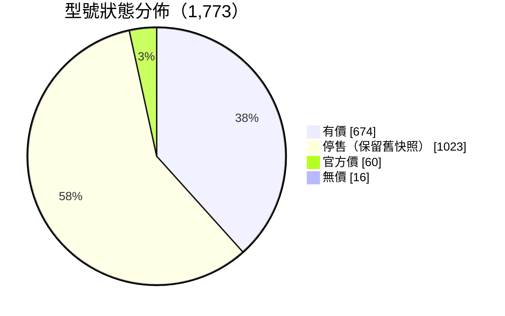
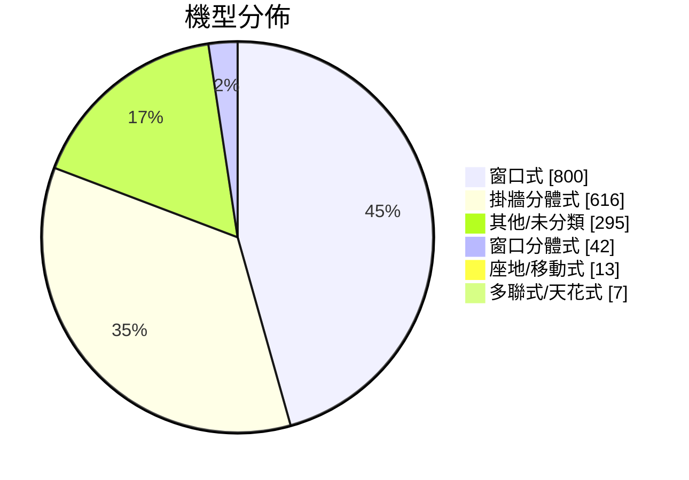
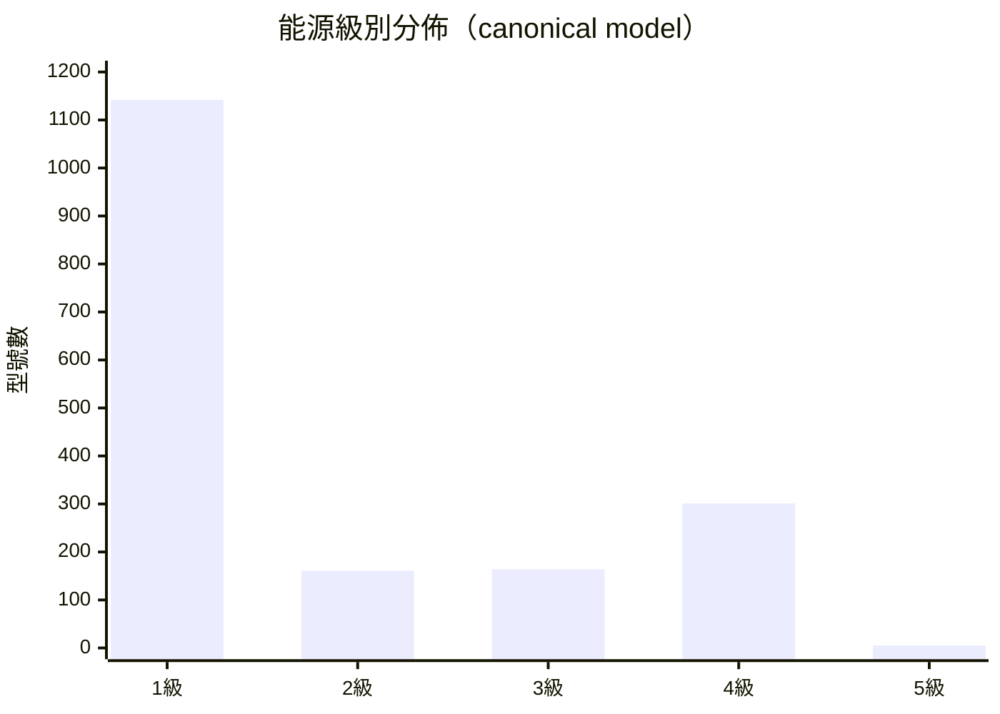
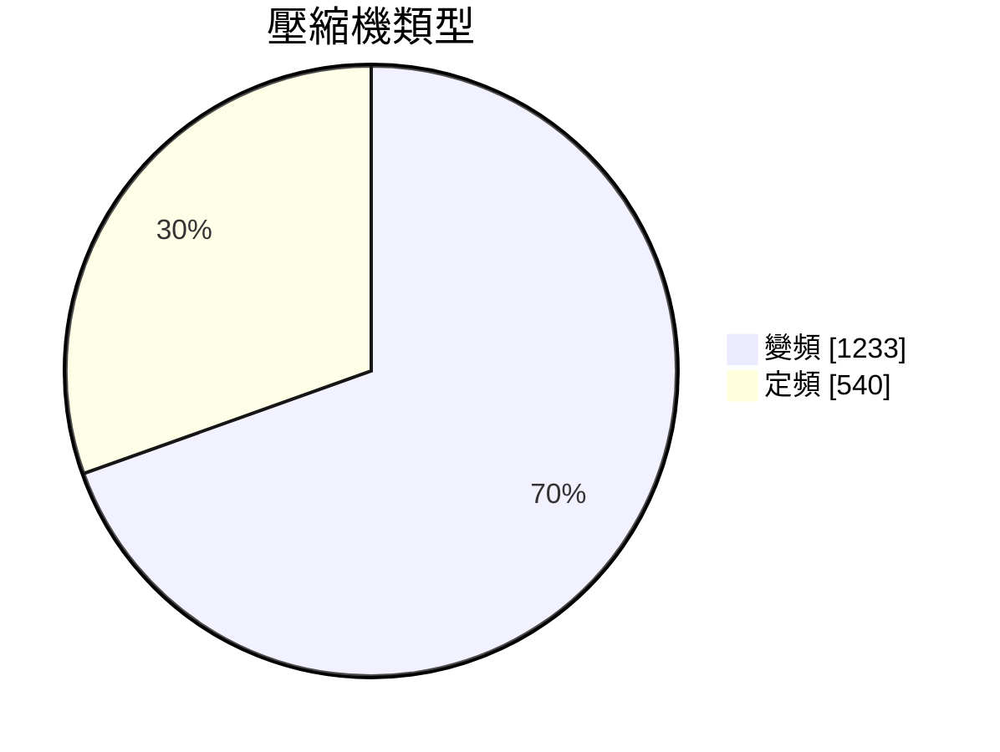
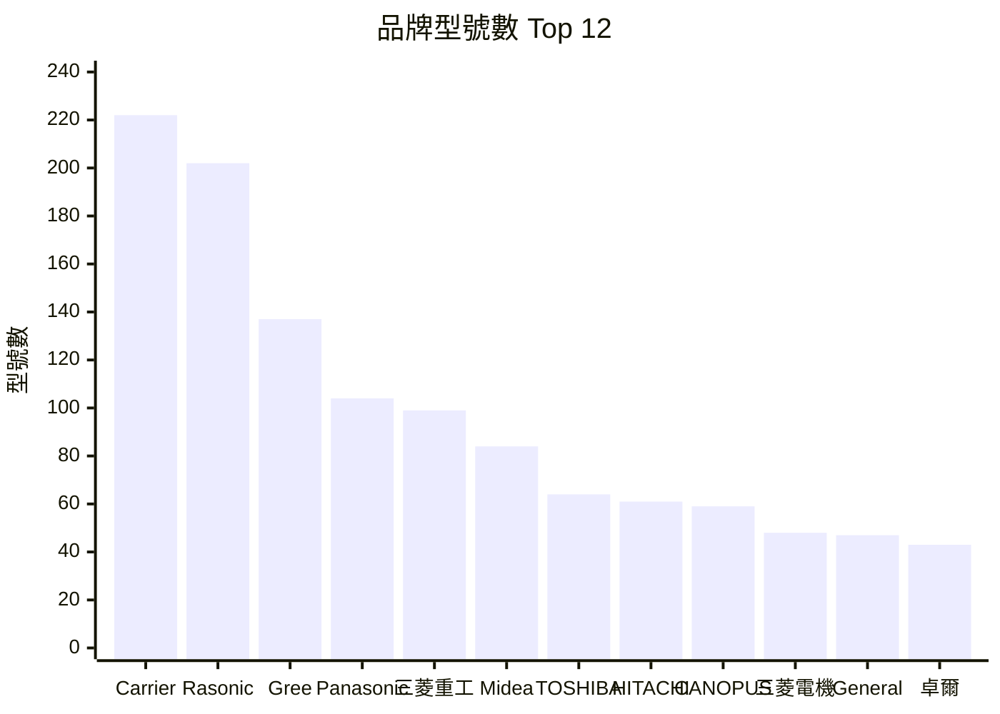
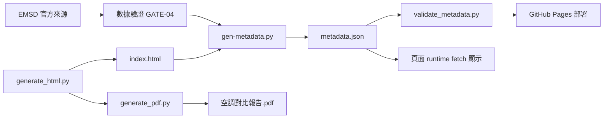
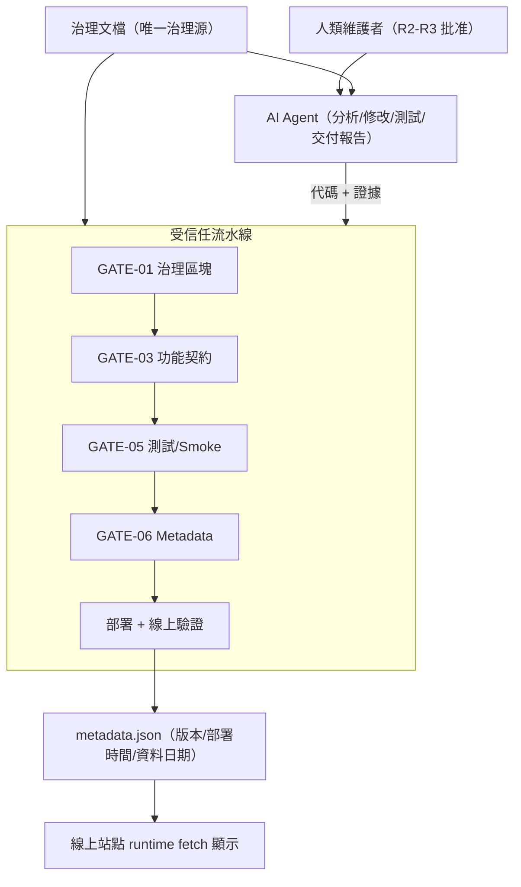

# ❄️ 香港空調對比報告（網頁版） 

> 香港市場空調（窗口式 / 分體式 / 流動式；淨冷/冷暖、定頻/變頻）全面對比
> **能源級別、雪種、年耗電以機電署 EMSD 官方資料庫全量核實**（最新同步快照 2026-09-22：1,834 筆登記／1,773 型號；2026-09-21 及之前詳細統計段落屬歷史快照，以線上 [`metadata.json`](https://calvinlau1012.github.io/aircon-compare/metadata.json) 為準）
> **220 個型號已直接經品牌官網/官方網店/總代理逐型號核實（2026-08-15 歷史核實數）**
> 🎨 **Blue Fantasy 藍色幻想 skin**（dsh-web-ui 皮膚；只套皮膚，其他插件不加）
> 📌 **現況**：線上部署版本 **v1.2.8**（badge 動態讀取線上 metadata.json）；本機另已建立 **v1.2.9 修復候選**（未發布、未部署）——時間／資料真實性、完整 Schema 驗證、部署後核對與歸檔、恢復演練；2026-09-22 再加 D1-B coverage pending、D2-A Pages Actions、D4-A 全歷史審計、D7-A 原始 EMSD hash receipt、D8-A 72h monitor；2026-09-23 已套用 D3-A，`release` environment 以維護者為唯一 required reviewer 並允許自行批准；2026-09-22 核查的部署 build `B20260922.83`（run 35776119746），EMSD 每日偵測、價錢按批次快照（缺價標「待查」）

## 🚀 立即使用

**線上版**：<https://calvinlau1012.github.io/aircon-compare/> （GitHub Pages）

**離線版**：下載 [`index.html`](index.html)，直接在瀏覽器打開（型號資料、搜尋／篩選／排序／比較全部可用，可 email / WhatsApp 轉發）。
> ⚠️ 版本／「最後部署」／資料日期由頁面 runtime 讀取同目錄的 `metadata.json`；以 `file://` 單獨開啟或只轉發 `index.html` 時不會載入到，會顯示「暫不可用」（資料本身已內嵌，不影響比較功能）。要完整顯示狀態，請用線上版，或把 `index.html` 與 `metadata.json` 放在同一目錄並經 HTTP 提供（例如 `python -m http.server`）。

## ✨ 功能

- ⚖️ **互動比較器**：勾選 2 個或以上型號，即時彈出 18 項屬性對比表（自動高亮最平/最慳電/最高 CSPF）
- 🔍 搜尋（品牌/型號）+ 自由篩選標籤（品牌、機型、匹數、能源、價位、停售狀態）+ 排序（價格 / 能源 / 年耗電 / CSPF）
- 🛒 1,752 個型號附價格快照（2026-09-22 同步快照重算；BigGo 官方 API 快照 751 有價 + Price 舊快照 1,847 後備；缺價標「待查」），點擊 🔍 直接在你的瀏覽器用 Google 搜最新價
- 📱 手機 / 平板 / 桌面全響應式（表格可橫向捲動）
- 🌙 深色模式自動跟隨系統，並已修正目錄連結／表格 hover／code／引用／卡片／按鈕等對比度
- 📊 完整報告：定頻 vs 變頻、統合總表、官方驗證、能源分析、深度分析、排名、推薦、價格驗證、論壇討論精華

## 📊 數據

| 項目 | 數量 |
| ------ | ------ |
| 比較器總型號 | **1,773**（核心 29 + 其餘 EMSD 型號 1,744；全量去重後包含核心 29；＝ metadata.json `modelCount` · 2026-09-22 快照） |
| EMSD 官方登記 | **1,834 筆**（`registrationCount`／`rawRecordCount` · 2026-09-22 EMSD 收據；登記筆數與型號數口徑不同，不可互換） |
| 有價格型號 | 1,752（網站 hero 依同步快照重算，2026-09-22） |
| 有尺寸型號 | 1,582（同上，按 2026-09-22 快照重算） |
| BigGo 香港格價快照 | 751 有價（官方 JSON API；分批批次快照，更新至 2026-09-14） |
| Price.com.hk 舊快照 | 1,847（2026-08-15 後備價，缺價標「待查」） |
| PricesAPI 核心驗收型號 | 29（選用驗收/後備，每月免費額度內） |
| 淘汰黑名單 | 1,097 canonical keys（更新 2026-09-14；網絡錯誤不計入） |
| 品牌官網核實型號 | 220（8 品牌，2026-08-15 歷史核實數） |
| 對比屬性 | 18 項 |

### 📈 數據統計（2026-09-22 同步快照 · 同一資料源即時計算）

#### 狀態分佈（比較器標籤 · canonical 型號鍵）



> 2026-09-22 快照：canonical `BRAND|NORM`（D11）匹配後，有價 674、停售 1,023、官方價 60、無價 16，合共 1,773。2026-09-21 舊數字為歷史快照。

#### 機型分佈



#### 能源級別（EMSD 全量 canonical model · 2026-09-22）



> canonical model 按 `BRAND|NORM` 去重（1,773 個，2026-09-22 快照）：1 級 1,142／2 級 161／3 級 164／4 級 301／5 級 5；EMSD registration（1,834 筆登記）為 1,199／161／168／301／5。核心 29 精選為 1 級 13、3 級 9、4 級 7、2／5 級 0——三種口徑不同，不可混用。

#### 類型與匹數



| 匹數 | 型號數 |
| --- | --- |
| 1 匹 | 490 |
| 1.5 匹 | 431 |
| 2 匹 | 419 |
| 2.5 匹或以上 | 242 |
| 3/4 匹 | 191 |

#### 價位分佈（BigGo 751 個有價型號 · 2026-09-14 快照）

| 價位 | 型號數 |
| --- | --- |
| $2,000 以下 | 72 |
| $2,000-3,000 | 180 |
| $3,000-4,000 | 146 |
| $4,000-5,000 | 113 |
| $5,000 以上 | 240 |

#### 品牌分佈（Top 12）



> 🎨 角色形象：whale-girl 鯨魚娘（寵物皮膚：[zhu1090093659/dsh-web-ui](https://github.com/zhu1090093659/dsh-web-ui) · 介紹：[linux.do](https://linux.do/t/topic/2751323)）
> 🙏 **特別鳴謝**：Blue Fantasy 皮膚原作 **powerdog996（DreamSkin 社區）**、dsh-web-ui 適配與鯨魚娘素材提供者 **zhu1090093659**，以及 linux.do 介紹帖作者

## 🏭 品牌官網核實（2026-08-15）

| 品牌 | 官方渠道 | 型號數 |
| ------ | --------- | ------- |
| Carrier 開利 / Canopus 肯特 | century-carrier.com 世紀開利 | 79 |
| Rasonic 樂信 | shew.com.hk 信興 + rasonicshop.hk 官方網店 | 50 |
| Panasonic 樂聲 | panasonic.hk + 信興 eShop | 25 |
| COMFEE | feelcomfee.com | 18 |
| GENERAL 珍寶 | general-aircon.com 總代理（第一電業） | 16 |
| HITACHI 日立 | hitachi-homeappliances.com.hk | 16 |
| Midea 美的 | mideahk.com | 12 |
| FROSTAR 霜牌 | rasonicshop.hk（信興姊妹品牌） | 4 |

> ⚠️ Gree/TOSOT 代理官網無窗口機產品頁 → 維持 EMSD/Price 雙源並標註「待查」，**絕不編造**。

## 🔄 自動更新（EMSD 偵測 · 分批快照）

- **排程**：GitHub Actions 每日 00:30（香港時間；cron `30 16 * * *`）輕量偵測 EMSD；**GitHub 排程可能延遲**，實際 run 時間以 Actions 記錄為準，並非精準 SLA
- **EMSD 快照**：每次抓取寫入 `emsd_receipt.json`（逐頁行數、總登記數、成功／失敗）；抓不齊或中途失敗**不會覆寫**現有 CSV
- **新機偵測**：比較 EMSD 官方資料庫新舊型號，新上市型號自動入庫並在網頁「🆕 最近新上市」顯示；官網核實分兩日分批進行，沒有新機就不更新內容
- **價錢快照（分批）**：**BigGo 官方 JSON API**（`api.biggo.com`，官方免費認證，憑證只放 GitHub Secrets）＋ PricesAPI 核心 29 驗收／後備 ＋ Price.com.hk 舊快照；每月最多一輪、分 7 日分批（2026-09 已完成 7/7）；**價錢為快照，未收錄／無報價標「待查」**，點 🔍 在瀏覽器用 Google 搜最新價
- **更新頻率口徑**：每日只偵測 EMSD 新機；官網核實（2026-08-15 的 220 個型號）與 BigGo 快照（更新至 2026-09-14）屬分批檢查結果，**不是每日全量刷新**
- **安全**：BigGo 官方憑證只放 GitHub Actions Secrets（`BIGGO_CLIENT_ID`／`BIGGO_CLIENT_SECRET`）；PricesAPI key 只放 Secrets（`PRICESAPI_API_KEY`），核心 29 驗收用 repo Variables `PRICESAPI_CORE_CHECK=1` 選用；權限只限 `contents: write`；官方 Actions 版本 `checkout@v4`／`setup-python@v5`；設 concurrency 防重疊
- **部署顯示**：頁面 runtime 讀取 `metadata.json`：`version`、`deployTime`（UTC 產生、HKT 顯示）、`datasetDate`；載入失敗顯示「暫不可用」，不顯示硬編舊值。`deployTime` 依治理定義為**部署包封裝時間**，非 CDN／Pages 完成時間
- **資料日期口徑**：`datasetDate` 現以 runner UTC 日期產生（`retrieval-date-fallback`），UI 部署時間以 HKT 顯示，兩者可能跨日；此為現行已知限制（尚未修正）
- **淘汰機制**：`model_lifecycle.py` 只把「乾淨無市售報價」（連續多次；網絡錯誤不計，D8）的型號入黑名單；每批小額復核，有價會自動復活；核心 29 及官方網店價型號受保護，不自動淘汰
- **穩定**：抓取後經「數據驗證閘門」(`validate_data.py`) 檢查數量在安全範圍——不合格就不提交，保住現有數據；每次成功提交 = 可回溯快照
- 亦可在 GitHub Actions 頁面手動觸發（workflow_dispatch）

## 🏛️ 治理標準

項目依 `docs/AIRCON_COMPARE_GOVERNANCE.md`（唯一治理源）運作，版本/部署時間/資料日期全部由流水線生成的 `metadata.json` 提供。

### CI 門禁（全部 Block 級）

| Gate | 階段 | 檢查內容 |
| --- | --- | --- |
| GATE-01 | 治理靜態 | 六個規範區塊嚴格提取 + JSON 解析 |
| GATE-03 | 功能契約 | 功能註冊表 Schema + 15 項 required 測試綁定 |
| GATE-04 | 數據 | EMSD 行數 / 價格 / 規格安全範圍 |
| GATE-05 | 測試/Smoke | 單元測試 + 瀏覽器核心路徑 smoke |
| GATE-06 | Metadata | `metadata.json` 兩階段封包（D14；deployTime UTC 自動）+ Schema 驗證 |

### Metadata 鏈路



### 功能註冊表（15 項 required，全部有測試綁定）

| 類別 | 功能 |
| --- | --- |
| core | search · filter · sort · compare · ranking · recommendation |
| ui | comparison-modal · responsive |
| data | emsd-verification |
| report | pdf-export |
| operations | version-display · last-deploy · dataset-update · build-metadata · github-pages-deploy |

### 決策記錄

人類決策項與因技術限制導致的方案轉向，見 `docs/DECISIONS.md`（含背景、選項、決策與原因）。

### 治理範疇一覽（完整版見治理文檔）

| 範疇 | 治理文檔章節 | 現況 |
| --- | --- | --- |
| AI Governance | §0 執行契約 · §3 執行流程 · §14 交付報告 | ✅ 已落地 |
| Architecture Governance | §1 單一事實源 · §16 落地結構 | ✅ 已落地 |
| Feature Governance | §5 功能註冊表（15 項 required） | ✅ 已落地 |
| DevOps Governance | §11 部署後驗證 · §17 核對表 | ✅ 已落地 |
| CI/CD Governance | §9 門禁 GATE-01~09 | ✅ GATE-01/03/04/05/06 已上 CI；GATE-08/09 程式與 workflow 候選已實作（未部署／未發布） |
| Version Governance | §8.1 SemVer + `models_data.VERSION` 單一來源 | ✅ 已落地 |
| Release Governance | §8.3 發布資產 · §17 | ✅ 已落地 |
| Rollback Governance | §7.3 回滾元數據 · §11.3 四級回滾 · §11.4 七步流程 | ✅ 已落地 |
| Monitoring Governance | §11.2 最低監控 | ✅ 規範就緒 |
| AI Agent Governance | §0.3 任務模式 · §4 角色/風險/批准 · §4.4 權限模型 | ✅ 已落地 |

### DevOps 最終目標

| 目標 | 狀態 | 機制 |
| --- | --- | --- |
| 每次部署自動產生版本資訊 | ✅ | GATE-06 `metadata.json.version` |
| 每次部署自動產生最後部署時間 | ✅ | `metadata.json.deployTime`（HKT 顯示） |
| EMSD 更新自動檢測 | ✅ | 每日 00:30 HKT cron + 新機偵測 |
| Feature 不得被 AI 誤刪 | ✅ | 功能註冊表 + GATE-03 feature-check |
| 所有重要功能有 Smoke Test | ✅ | GATE-05 瀏覽器核心路徑 12 項 |
| 所有變更有 Changelog | ✅ | `CHANGELOG.md` + 各文檔更新日誌 |
| 支援多人協作 | ⚠️ | git + concurrency group；PR 審批流程待完善 |
| 支援多 AI 協作 | ✅ | 治理文檔面向人類 + AI + CI 三類執行者；角色分工見下 |
| 支援未來 v2.0 平台化 | ⚠️ | §16 目標結構已定義；未啟動 |

### AI 協作角色（透明說明）

| 角色 | 負責範圍 |
| --- | --- |
| **OpenAI Codex** | 規劃、治理約束、整合設計、獨立驗收與返修決策 |
| **DeepSeek `deepseek-flash`（thinking max）** 經 Pi coding-agent／`ds-exec` | 本地診斷、實作、測試、分支整合 |
| **人類維護者** | 批准 R2/R3 決策、最終 merge 與發布 |

> ⚠️ AI 輔助唔等於官方資料已由 AI 證實：能源／雪種／耗電以 EMSD 官方資料為準，尺寸／保養／官方價以品牌官網為準，價錢為市場快照；所有結論以可重跑測試及實際證據為據。
> 🎨 歷史設計主題「DeepSeek 鯨魚娘」（skin／角色素材）屬美術來源鳴謝，與上述工程協作角色分開。

### 回滾與版本策略（摘要）

- **版本**：SemVer；版本號唯一手動來源 `models_data.py` 的 `VERSION`；部署事實一律由流水線 `metadata.json` 提供
- **回滾**：四級（L1 代碼修復 → L2 應用回滾 → L3 數據快照 → L4 全站）；目標必須由 tag/commit/發布摘要/快照 ID 唯一確定；每次成功提交 = 可回溯快照

> 自建／私人部署線（容器、持久發佈、sandbox）已移離公開 repo；公開候選只保留
> GitHub Actions 每日更新與 Pages 發佈路徑。正式部署／回滾由維護者喺私人環境執行，
> 詳細 runbook 與歷史記錄暫存於 repo 外可恢復副本（未係長期私人儲存；commit／push 前須轉移＋核驗）。

### 治理架構圖（完整四圖見治理文檔 §1.1.1/§3.5/§4.4/§9.1.1）



## 🔧 自行重建

```bash

python -m pytest tests/ -q     # 先 pip install -r requirements-dev.txt（預設收集瀏覽器 smoke）
python validate_data.py        # 數據驗證閘門
python generate_html.py        # 讀取 .md + JSON 資料庫 → 生成空調對比報告.html（含動態數字／能源分佈）
python generate_pdf.py         # 生成 空調對比報告.pdf（與 Web 共用同一 metadata 規則）
copy 空調對比報告.html index.html   # Windows：同步 GitHub Pages 入口（Linux/macOS 用 cp）

```

資料庫重新抓取（可選）：

```bash

export BIGGO_CLIENT_ID=xxx   # BigGo 官方認證；或在 GitHub Actions Secrets 設定（憑證不入 repo）
export BIGGO_CLIENT_SECRET=xxx
python fetch_biggo.py --smoke        # 先做連線／認證 smoke（多候選，首個有價即通過）
python fetch_biggo.py --price-batch  # BigGo 分批價錢批次（正式批次已內建先 smoke）
python fetch_biggo.py --force-batch  # 一次性全量強制批次（測試用）
export PRICESAPI_API_KEY=pricesapi_xxx   # 或在 GitHub Actions Secrets 設定
python fetch_pricesapi.py --core   # PricesAPI 核心 29 驗收/後備（不跑批次）
python fetch_prices.py         # Price.com.hk 舊快照（1,847 型號，可選；已被 Cloudflare 封）
python fetch_official.py       # Panasonic/HITACHI/COMFEE 官網規格
python fetch_shew.py           # 信興官網 Rasonic 規格
python fetch_carrier.py        # 世紀開利 Carrier/Canopus 規格
python fetch_general.py        # 珍寶總代理規格
python fetch_rasonic.py        # 樂信官方網店價格

```

## 📁 專案檔案

| 檔案 | 說明 |
| ------ | ------ |
| `index.html` | 網頁版報告（型號資料內嵌；版本／部署／資料日期 runtime 讀取 `metadata.json`；`空調對比報告.html` 為本機生成物，不入庫） |
| `空調對比報告.md` | Markdown 報告全文 |
| `需求摘要.md` | 需求元文件 |
| `generate_html.py` | 網頁生成器（md + JSON → HTML） |
| `models_data.py` | 核心 29 型號資料庫（`MODELS` / `VERSION` 單一來源，供 generate_html / fetch_* 共用） |
| `crawl_utils.py` | 共用工具（誠實 UA / 型號規範化 / JSON 讀寫 / HTML 轉字 / 退避重試 / SSL context） |
| `price_utils.py` | 價錢過濾共用工具（冷氣關鍵詞 / 配件排除 / 價格範圍格式化） |
| `batch_utils.py` | 價錢批次 meta / 進度共用工具（每月一次分 7 日、冷卻期、打卡、部署時間） |
| `model_lifecycle.py` | 型號淘汰/黑名單管理（連續無市售報價自動停止更新） |
| `model_blacklist.json` / `model_status.json` | 淘汰黑名單 / 追蹤記錄（canonical keys；網絡錯誤不計） |
| `metadata.json` | 部署事實單一來源（版本／建置／部署時間／資料日期／payload hash），由流水線生成，不手改 |
| `emsd_receipt.json` | EMSD 抓取收據（逐頁行數／總登記數／成功或失敗；失敗不覆寫 CSV） |
| `pytest.ini` | pytest 設定（預設收集瀏覽器 smoke，避免核心路徑被靜靜略過） |
| `validate_data.py` | 數據驗證閘門（自動更新防壞數據） |
| `tests/` · `requirements-dev.txt` | 單元測試 + 開發依賴（pytest） |
| `emsd_空調能源標籤.csv` | EMSD 官方資料庫快照（2026-09-22 快照：1,834 筆登記 / 1,773 型號；以 `metadata.json` 為準） |
| `prices.json` / `specs_emsd.json` | Price 舊快照 / 規格資料庫（後備） |
| `biggo_prices.json` | BigGo 官方 JSON API 價錢快照（751 有價，更新至 2026-09-14；主力價錢源） |
| `pricesapi_prices.json` | PricesAPI 核心 29 驗收快照（選用後備；有跑 `fetch_pricesapi.py --core` 時才生成，需 API key） |
| `whale_girl.webp` / `whale-girl.ico` | whale-girl 鯨魚娘角色立繪（官方 sprite 高清提取 WebP + 用戶原始 ICO） |
| `blue_fantasy_art.txt` | Blue Fantasy skin 背景 whale art（data URI，網站內嵌用） |
| `official_specs.json` 等 7 個 `*_official.json` | 品牌官網核實數據 |
| `fetch_*.py` | 各數據源抓取腳本（EMSD/PricesAPI/Price/官網） |

## 🧭 開發困難與決策（紀錄）

> 完整決策記錄（含人類決策項、背景、選項、原因）見 `docs/DECISIONS.md`。以下為重點摘要。

### 1. 價錢數據源被封

- **困難**：Price.com.hk 全站被 Cloudflare「Just a moment…」質疑頁攔截——urllib、Playwright headless、有頭瀏覽器全部被擋；確認不是限流（等冷卻無效），而是硬性封鎖
- **決策**：**不用代理繞過**（保持誠實爬蟲）；探測十多個來源後，改用 **BigGo 香港格價**作主價源（多商戶報價，性質與 Price.com.hk 一致，urllib 直連無 Cloudflare）
- **升級**：改用 BigGo **官方公開 JSON API**（`api.biggo.com/api/v1/spa/search/{型號}/product`，`site=biggo.hk`、`region=hk`），不再解析 HTML（當時商品搜索免憑證；2026-08-26 起免登入通道關閉，改用官方 client credentials，見 D10）；修復分體機型號斜杠（`/`）未編碼導致 403 的 bug
- **再升級（2026-08-16）**：曾試用 **PricesAPI**（`api.pricesapi.io`，香港市場、免費 1,000 calls/月）；實測 BigGo MCP Server 後，確定主力用回 BigGo，PricesAPI 只保留核心 29 驗收/後備
- **限流轉向（2026-08-26）**：GitHub Actions IP 被 BigGo 網頁版限流 → 經人類決策先採純快照 → 發現官方 JSON API（不同主機）後轉向 API 方案（見 DECISIONS.md D1-D3）

### 2. Gemini 人手查價全量失敗

- **困難**：Web 版 Gemini 幫手查價，29 個型號批次成功（21 個有價），但 1,874 型號全量批次幾乎全部空回應（只有舊批次重複答案，Flash-Lite 未登入模式處理不了）
- **決策**：放棄 Gemini 全量路線；保留那 21 個有價結果作補充源；主力確定用 BigGo 自動分批負責，PricesAPI 作核心 29 驗收/後備

### 3. 每日抓價觸發防護

- **困難**：每日全量抓價令封鎖越來越頻密，價錢更新風險大
- **決策**：價錢改為**快照策略**——不再每日更新，有新機時每月最多分批更新一次（分 7 日）；點擊 🔍 在瀏覽器直接 Google 搜最新價

### 4. 官方數據缺口

- **困難**：Gree/TOSOT 代理官網沒有窗口機產品頁；EMSD 原始品牌名五花八門（如「日立牌」vs HITACHI），令品牌篩選分裂
- **決策**：維持 EMSD / 零售商雙源並標註「待查」，**絕不編造**；建立品牌名稱統一映射表

### 5. 自動化穩定性

- **困難**：GitHub Actions 並行 push 衝突；可重用工作流 timeout 配置位置報錯
- **決策**：push 失敗自動 `git pull --rebase` 重試；timeout 表達式移入可重用工作流內部；設 concurrency + 數據驗證閘門，驗證不過就不提交

**價錢優先級**：BigGo 實抓 ＞ PricesAPI 核心 29 驗收 ＞ Gemini AI 搜 ＞ Price 舊快照（後備）

## ⚠️ 免責聲明

1. 價格及供應隨時間變動；價格為 BigGo 官方 API／Price.com.hk 等**分批快照**（以報告及各表標示日期為準），缺價標「待查」，僅供參考（以商戶實時報價為準）
2. 能源級別/雪種/年耗電以 EMSD 官方資料庫為準；尺寸/淨重/保養以品牌官網為準
3. Gree/TOSOT 保養等未能官網核實之規格為零售商交叉核實結果，表中標註「零售商規格」
4. 噪音 dB 為參考級（無官方文件）
5. 「論壇討論精華」為 LIHKG 用戶主觀評價摘錄，不代表本報告立場
6. 本報告由 AI 輔助製作，關鍵數據已盡量經官方核實，惟仍可能有錯漏
7. 本報告僅供選購參考，不構成購買建議

## 🏷️ 版本記錄

| 版本 | 日期 | 重點 |
| --- | --- | --- |
| **v1.2.9**（候選·未發布·未部署） | 未發布 | 時間／資料真實性：EMSD 收據事實（實際 UTC 抓取時間＋CSV hash 綁定、失敗收據、50 倍數頁數）；完整 Draft 2020-12 Schema＋`--core` fail-closed；feature-check 實際 collection／執行證據；GATE-08 部署後核對＋GATE-09 歸檔候選；本地恢復演練 16 斷言。產品 VERSION 已係 `1.2.9`，但線上 `metadata.json` 仍係 1.2.8 |
| **v1.2.8** | 2026-08-26 | 治理落地（門禁 + metadata.json + 功能註冊表 15 項綁定）+ PDF 報告導出 + BigGo 改官方 JSON API（解決 GitHub IP 限流）+ 文檔全面書面語化 |
| **v1.2.7** | 2026-08-25 | 皮膚/深色模式全面恢復（Blue Fantasy 壁紙 + whale-girl 吉祥物 + 元件級對比度）+ 響應式適配修正（手機下拉溢出/吉祥物重疊）+ 工具複用整理 |
| **v1.2.6** | 2026-08-25 | 代碼重構（`models_data.py` / `batch_utils.py` + `fetch_*` 統一重試）· 深色模式對比度修正 · 生成效能優化（版本號維持） |
| **v1.2.6** | 2026-08-20 | 網頁 hero 顯示成功更新日期時間（`last_deploy` 香港時間） |
| **v1.2.5** | 2026-08-18 | 停售/官方價/價位標籤化：黑名單以「停售」標籤展示，用戶可自由篩選 |
| **v1.2.4** | 2026-08-18 | 本地全量 BigGo 搜索完成：有價 734；確認第一版淘汰黑名單 1,103 個 |
| **v1.2.3** | 2026-08-18 | BigGo 線上 smoke 防護 + 型號淘汰黑名單機制（6 個 2020 舊型號自動停止更新） |
| **v1.2.2** | 2026-08-16 | 全項目說明文件同步、每日檢查打卡（`last_check`）、BigGo 驗證閘門、抽取 `price_utils.py` 重用工具 |
| **v1.2.1** | 2026-08-16 | 主力價錢源確定用回 **BigGo 官方 JSON API**；PricesAPI 改為核心 29 驗收/後備 |
| **v1.2.0** | 2026-08-16 | 主力價錢源改用 **PricesAPI 香港格價**（免費 1,000 calls/月、核心 29 優先）；BigGo/Price 舊快照做後備 |
| **v1.1.1** | 2026-08-16 | 修正 TOSOT/Gree 規格被重複 dict key 覆蓋丟失；代碼重構（crawl_utils 共用 + 單元測試 + XSS 加固 + 版本號單一來源） |
| **v1.1.0** | 2026-08-16 | BigGo 官方 JSON API 全量實抓（731 型號）+ 深海女仆（DeepSeek 鯨魚娘）主題 UI |
| **v1.0.0** | 2026-08-15 | 正式版：全量 1,854 型號 + 官網核實 220 + 互動比較器 + 論壇討論精華 + GitHub Pages |
| v0.2.0 | 2026-08-12 | EMSD 全量 1,927 型號核實（能源/雪種/耗電） |
| v0.1.0 | 2026-08-11 | 報告初版（29 型號統合對比） |

## 📅 更新日誌

### 2026-09-23 — PR #10 審查返修（本機候選，未部署）

| 類別 | 內容 |
| ------ | ------ |
| 📦 Pages 封包 | `deploy_envelope.json`：payload + 最終 `metadata.json` + 一致公開 sidecar；封包前驗 Schema／version／payload hash／CSV hash／counts；PR 用隔離 fixture metadata + 真 HTTP／瀏覽器／PDF 重建驗證 |
| 🔁 daily→Pages | push 後以 `repository_dispatch` 帶精確 commit＋sourceRunId／attempt；Pages 有界 polling 核實 completed/success＋workflow path＋單親 direct parent＋metadata `workflowRunId`／`commit`，PR／fork 永不 deploy；concurrency 按 event／ref 隔離＋`queue: max` |
| 🚨 monitor | freshness 同 postdeploy 合併判斷；fingerprint 不含 ageSeconds；分類改變才 update、完全恢復 close；report／network／API 錯誤非零且脫敏 |
| 🔐 raw sink | 可插拔 adapter：local 如實標示非 durable；GitHub Release asset 候選（PRIVATE 回讀、拒覆蓋、下載 hash 核驗、90 日 retention）；未經批准唔建 Release |
| 🛡 輸出安全 | `build_pages_artifact` 拒危險 `--out`、staging 安全替換、失敗唔刪既有內容；symlink／junction 測試無 skip |
| ✅ 驗證 | 本機 475 passed／0 skipped、feature-check 18 節點 `--run-tests` 全 pass、acceptance 7 gates rc=0；詳見 docs/STATUS §11 |
| 🔀 R7 同步 | merge `origin/master` `be43b7c`（2026-09-22 自動更新）解除 PR conflict；EMSD 現況日期同步為 datasetDate 2026-09-22（型號／登記數不變）；受影響 docs／PDF／index 按合併後程式與已提交資料重建 |
| 🔒 R7 收緊 | source run binding 加 completed polling／run attempt／daily workflow path／單親 direct parent／metadata workflowRunId＋commit；Pages production concurrency 加 `queue: max` |

### 2026-09-22 — 第五輪精確返修（本機候選，未部署）

| 類別 | 內容 |
| ------ | ------ |
| 🧱 staging parser | 修正 `git diff --cached --name-status -z` NUL token 解析；deletion／rename／truncated／unknown／invalid UTF-8 全拒；index snapshot＋失敗原子恢復 |
| 🔐 release 路徑 | 新增 `safe_report_path`（拒逃逸／absolute／backslash／symlink）；required report exactly-one；acceptance schema／commit／runner 嚴格驗證 |
| 🚦 official receipt | strict marker 綁定（script／counts／lists／covers=union）；listed model 必須有 output evidence；ready receipt 先寫再 advance |
| 🧾 runner 信任 | CLI 移除任意 `--spec`；gate ID 安全 unique；未知 `--only` 非零；machine evidence 必須 repo 外 |
| 📅 price meta | 真實日曆日期／月份／deploy 時間驗證；`detect_mode` 唔再吞錯轉 full |
| ✅ 驗證 | 本機 399 passed、feature-check 18 節點、acceptance 7 gates rc=0；詳見 docs/STATUS §9 |


### 2026-09-22 — 第六輪：D1-B／D2-A／D4-A／D7-A／D8-A（本機候選，未部署）

| 類別 | 內容 |
| ------ | ------ |
| 🚦 D1-B | 官網批次分開硬失敗與 coverage pending；pending 原樣保留 queue／models 並出公開 status，UI 顯示「官網規格待核」；壞 receipt／failed／hash race 仍阻斷 |
| 🌐 D2-A | 新增 `pages-deploy.yml`：PR build＋7 gates 不部署；master deploy 需 build 通過、`github-pages` environment、最小 Pages 權限；artifact 只含 manifest 公開檔，拒 symlink／traversal／額外私人檔；`postdeploy-verify` 綁 exact head_sha；新 workflow merge 前由 `daily-update.yml` 唯讀 PR gates bootstrap |
| 🕵️ D4-A | 新增 `check_public_history.py` 全 reachable refs credential audit（實跑 0 credential findings；self-host 只列 residual risk）；報告寫 repo 外 |
| 🧾 D7-A | `fetch_emsd.py` 保存逐頁原始 bytes hash＋公開 `emsd_raw_receipt.json`；私人 sink 介面／require fail-closed／90 日 retention；raw bytes 不入公開 artifact |
| ⏱️ D8-A | 72h 新鮮度硬邊界、6 小時 monitor、單一 issue 去重／更新／恢復關閉；postdeploy hash／schema 先驗 |
| 🔐 D5-A | 私人包已入 私人 repo（PRIVATE API 回讀；名稱只喺交付報告）；fresh clone 逐檔 checksum 通過；Temp 原件保留 |
| ✅ 本輪驗證 | pytest 433 passed／1 skipped；focused 69 passed／1 skipped；feature-check 18 nodes；acceptance 7 gates rc=0；history audit credentialFindings=0 |
| 🧭 平台 | D3-A 已設定：`release` environment 唯一 required reviewer 為 `CalvinLau1012`，`prevent_self_review=false`（2026-09-23 API 回讀）；D6 self-host 線同步 deferred；E3／E4 仍 UNKNOWN，未部署 |

### 2026-09-22 — v1.2.9 綜合返修（本機候選，未部署）

| 類別 | 內容 |
| ------ | ------ |
| 🧱 queue 契約 | 新增 `queue_utils` 單一契約（stage 0/1/2、models 驗證）；workflow 解析失敗即失敗，無 stage-0 fallback |
| 💰 price 進度 | 2→0 先啟動 price meta 後清 queue；meta fail-closed＋原子寫入；corrupt meta 阻斷 |
| 📦 staging | 拒絕 deletion／rename、manifest 共用契約、index 預檢、零部分 stage |
| 🕵️ privacy | tracked=HEAD blob／index=staged blob／worktree／tree 四模式；cat-file 嚴格、invalid UTF-8 阻斷 |
| 🧾 驗收 | machine acceptance runner（真實 rc／argv／log sha256／JUnit）；release 拒任意文字報告 |
| 🚦 官網批次 | machine receipt＋queue/output hash 綁定；未覆蓋 queue model fail-closed 保留（ADR-002） |
| ✅ 驗證 | 當時（R4）本機 368 passed、feature-check 18 節點；細節見 docs/STATUS §8（R5 後實數見 §9） |


### 2026-09-22 — v1.2.9 第二輪返修（本機候選，未部署）

| 類別 | 內容 |
| ------ | ------ |
| 🔐 CI 信任 | Chromium 提前／只裝一次；精確 allowlist（拒非負載／私人檔）；privacy index 模式；push fail-closed；build 加 run attempt；Actions 固定完整 commit |
| 🌐 GATE-08 | 接受 Pages `dynamic` 唔再被跳過；完整 metadata object＋Schema 才結束重試；PDF 同 metadata 重建一致；報告寫入失敗非零 |
| 📦 GATE-09 | 歸檔實際 bytes／zip／CHECKSUMS 全驗；provenance 分離；tag＝metadata.version；release 需有效機器報告；私隱掃描 |
| 🚦 批次 | 官網任一目標失敗即阻斷且不覆寫快照；BigGo 有網絡錯誤唔推進批次；EMSD 三檔交易提交＋crash journal |
| 🧾 契約 | feature-check 全面 fail-closed（skip／XPASS／deselect／缺階段）；validate_data 型別／行形狀契約；extractor 拒 NaN |
| 📄 PDF | invalid metadata 不可出 PDF；同輸入重建一致；HTML 同輸入一致 |
| 🕵️ 私隱 | `docker/`、`release/` 私人線移出公開工作樹（完整 bytes＋SHA256 喺 repo 外 Windows Temp 可恢復副本，未係長期儲存；commit／push 前須轉移＋核驗）；公開保留 fixture-only 恢復演練；Git 歷史尚待人類私評 |
| ✅ 驗證 | 全套 pytest 通過、feature-check 18 節點 passed、治理／metadata／資料閘門退出 0；詳見 docs/STATUS 與 GOVERNANCE_MATRIX |


### 2026-09-21 — v1.2.9 修復候選（本機已實作並通過 E2；未部署）

| 類別 | 內容 |
| ------ | ------ |
| 🕒 時間真實性 | EMSD 收據成功時對已寫入 CSV 計 `datasetHash`，`retrievedAt` 用實際抓取完成時間；403/429、0 頁、壞表頭、偵測失敗、寫入失敗都寫失敗收據；頁數 50 倍數唔再報錯，抓取失敗唔會被舊收據冒充成功 |
| 🔐 部署事實 | workflow 由 `emsd_receipt.json` 產生 `datasetDate`／`datasetRetrievedAt`／來源／快照 ID（實際 UTC 轉香港日期）；重建用舊完整收據保留舊日期；舊無 hash 收據明確失敗並要求重新抓取 |
| 🧪 完整驗證 | `validate_metadata.py` 改 Draft 2020-12 + FormatChecker（const／minimum／真實日期／URI 等）；`--core` fail-closed，core 驗證通過先生成 PDF |
| 🏛️ 治理證據 | `extract_governance.py` 拒重複 JSON key；Registry／成功標準按內嵌 Schema 完整驗證 |
| 🧾 功能契約 | `feature-check.py` 由檔案存在升級為 pytest 實際 collection node id＋靜態斷言檢查；`--run-tests` 收集 setup／call／teardown 同 skip／xfail／fail，required 綁定 skip 即失敗；第二輪再拒空斷言、常量斷言（`assert True`、`x = True; assert x`）及吞例外總是成功 |
| 🚦 批次閘門 | 官網批次改用 `run_official_batch.py`（return code＋輸出雙重檢查）；**任一目標失敗即非零、唔推進隊列**，失敗唔用部分結果覆寫快照；BigGo smoke 失敗如實標「未刷新、保留快照」，真失敗非零退出 |
| 🌐 部署後核對 | 新增 `scripts/postdeploy_check.py`＋`postdeploy-verify.yml`：expected＋online 完整 Draft 2020-12 驗證、整個 metadata object 等值、線上 payload／CSV hash、核心瀏覽器行為；接受 Pages `dynamic` 事件唔會被 skip，唯讀、官方 Pages 或 localhost |
| 📦 歸檔 | 新增 `scripts/archive_release.py`＋手動 `release-archive.yml`：reports 來源修正、`archiveCommit`／`sourceCommit`／`deploymentCommit` 分離、目錄＋zip 雙重 no-clobber、嚴格 SemVer；封裝前先跑 GATE-08；本輪未發布 Release |
| 🔐 Actions | 所有 workflow 第三方 Actions 固定到已核實完整 commit（checkout／setup-python／upload-artifact／download-artifact），符合治理 §9.3 |
| 🧯 回滾演練 | 公開 fixture-only `tests/test_restore_drill.py`：checksum、兼容版本、原子換入、篡改／truncated 失敗唔破壞 good package |
| 📄 文件 | README 版本記錄／更新日誌、CHANGELOG（1.2.9 候選與 1.2.8 後維護記錄分開）、docs/STATUS／README、D16、治理文檔版本記錄同步 |
| ⚠️ 邊界 | 本輪未 commit／push／deploy、未發 Release、未動 Secrets、未執行正式 apply／rollback；GATE-08／09 與收據新路徑需受信任 CI／部署先有 E3／E4 |

### 2026-09-21 — 同步遠端 master + 現況說明校正

| 類別 | 內容 |
| ------ | ------ |
| 🔄 同步 | 本機工作區由 `d55f56c` fast-forward 至遠端 `master` `3e2958d`（最後自動更新 2026-09-20）；本機原有 UI 修復已包含在遠端提交 |
| ✅ 證據 | 遠端 run 35530668350／Pages 35530841644 success；隔離 checkout 全套驗證 112 passed；線上 `index.html`／`metadata.json` 與同步後本機逐位元相同 |
| 📊 現況 | README／網站說明改以 2026-09-20 快照及線上 `metadata.json` 為準；分開列示登記筆數／去重型號／比較器總數；版本 badge 改動態讀取線上 `metadata.json` |
| ⚠️ 限制 | `datasetDate`（UTC）與 HKT 顯示可能跨日、GitHub 排程可能延遲、`deployTime` 為部署包封裝時間；均未修改邏輯 |

### 2026-09-14 — 私人部署工具（已移離公開 repo）

> 當時嘅自建伺服器持久發佈工具（image 重建、volume 同步、staging／apply／rollback）
> 及詳細歷史已移離公開 repo，記錄暫存於 repo 外可恢復副本；公開候選唔再包含相關 runbook 細節。

### 2026-09-13 — 本地整合驗證：網頁 Bug 修復 + 治理 PR-1～PR-3 + 兩階段 metadata

| 類別 | 內容 |
| ------ | ------ |
| 🔍 篩選 | 價位篩選修正：未知價型號唔再被歸入「5以上」；「只顯示已選」之下反選即刻由列表移除 |
| 📱 響應式 | 修復 721–999px 平板水平溢出（導覽 tooltip 絕對定位撐寬頁面 → 1000px 以下隱藏） |
| ♿ 無障礙 | 比較面板 Escape 關閉、焦點移入／返回、`role=dialog` + `aria-expanded`；搜尋及下拉加 `aria-label` |
| 🌗 對比度 | 深色頁腳 1.85:1 → 12.2:1；淺色連結／按鈕／hero 統計／最佳值標示全部 ≥4.5:1 |
| 🔢 版本 | 頁腳版本只讀 `metadata.json.version`，移除 HTML 內嵌版本常量 |
| 🧪 測試 | `pytest tests/` 預設收集瀏覽器 smoke；HTML 固定 LF（Windows 本地 = CI）；`test_pdf_export` 改用 `tmp_path`，測試前後 `空調對比報告.pdf` hash 不變 |
| 🏛️ 治理 | PR-1～PR-3 整合：canonical 型號鍵（D11）＋生命週期三態（D8）＋EMSD 保留全部登記（D12）＋價錢快照原始 key（D13） |
| 🔢 動態數字 | Hero／Open Graph／description 改用建置時實際計數（1,863 筆登記 / 1,814 型號）；歷史數字只留喺標明歷史嘅段落 |
| 🔄 流水線 | 兩階段 metadata（D14）：核心事實 → PDF 用同 run metadata → finalize payload hash；hash 範圍收斂為 `deploy_payload.json` 明確 manifest |
| ⚡ 能源 | 核心 29 表明確標示；級別固定 1→2→3→4→5（0 都顯示）；全量 canonical model／registration 分佈建置時動態生成（HTML + PDF） |
| 🔌 BigGo | smoke 改 3 個跨品牌候選，依序探測、首個有價即通過；`no-price`（個別型號無匹配）同 `unreachable`（限流等粗分類）分開報 |
| 🤖 AI | 協作角色透明說明：Codex（規劃／驗收）、DeepSeek `deepseek-flash` via Pi `ds-exec`（實作／測試／整合）、人類維護者（R2/R3 與發布） |

### 2026-08-26 — v1.2.8 治理落地 + PDF + BigGo 官方 API

| 類別 | 內容 |
| ------ | ------ |
| 🏛️ 治理 | 落地 `docs/AIRCON_COMPARE_GOVERNANCE.md`；四道 CI 門禁（GATE-01/03/05/06）；`metadata.json` 部署事實源（版本/部署時間 HKT/資料日期） |
| 📄 PDF | 新增 `generate_pdf.py`：PDF 報告導出（reportlab 內置中文字體，與 Web 共用同一 metadata） |
| 💰 價錢源 | BigGo 由網頁 scrape 改用**官方 JSON API**（`api.biggo.com`）——解決 GitHub Actions IP 被網頁版限流問題 |
| 📝 決策 | 新增 `docs/DECISIONS.md`：人類決策項與技術轉向均註明背景、選項、決策與原因（D1-D10） |
| ✍️ 文檔 | 說明文檔全面改為書面語（README/需求摘要/要求/報告/AGENTS/CONTRIBUTING/copilot-instructions） |
| ✅ 測試 | pytest 28 項 + 瀏覽器 smoke 5 項；功能註冊表 15 項 required 全部有測試綁定 |

### 2026-08-26 — BigGo 官方認證 + 本地全量復核 + 停售篩選修復

| 類別 | 內容 |
| ------ | ------ |
| 🔐 認證 | BigGo 關閉免登入 API（`require_login`）→ 改用**官方免費認證**（client_id/secret → access_token，55 分鐘快取）；憑證只放 GitHub Secrets（D10） |
| 🔎 全量復核 | 本地一次性全量（帶認證，零錯誤）：728 型號得價 722；黑名單 1,103 復核——復活 8 個重有市售報價型號、確認不再賣 1,095 |
| 🔍 篩選修復 | 比較器恢復「狀態」（有價/官方價/無價/停售）與「價位」下拉篩選 + 卡片狀態標籤（v1.2.5 功能於皮膚重構時遺失） |
| 📈 圖表 | README 新增數據統計章節（狀態/機型/能源/類型/匹數/價位/品牌分佈 mermaid 圖） |
| 🏛️ 治理 | 治理文檔新增四類架構圖（整體架構/AI 流程/AI Agent 權限/DevOps 流水線）+ 新增 `CHANGELOG.md`（Keep a Changelog 風格）+ README 治理架構一覽與 DevOps 目標清單 |

### 2026-08-25 — v1.2.7 皮膚恢復 + 響應式適配

| 類別 | 內容 |
| ------ | ------ |
| 🎨 皮膚 | 恢復 Blue Fantasy 壁紙皮膚 + whale-girl 吉祥物 + 玻璃質感（重構期間被刪，已還原 fbd3352 設計） |
| 🌙 深色模式 | 恢復 3 組深色區塊：變數 / 皮膚背景 / 元件級對比度（th/按鈕 #4F66AD 提亮、accent 深字、hero 白字陰影） |
| 📱 響應式 | 品牌下拉選單手機溢出修復（max-width）+ 深色 select 文字對比度 |
| 🐳 吉祥物 | 重疊修復：預設隱藏，超大屏（CSS ≥1600px）先顯示；文字層置頂 + 全文字陰影 |
| 🧰 工具 | `fetch_*`/`generate_html` 全面共用 `crawl_utils`/`batch_utils`/`price_utils`/`models_data`；修復 `SPECS_OVERRIDE` 9 個重複 key（P0） |
| ✅ 測試 | pytest 18/18 · 8 裝置 × 深淺色 16 組合適配測試 · BigGo 線上 smoke 通過 |

### 2026-08-25 — 代碼重構 + 深色模式對比度修正（文件同步，版本號維持 v1.2.6）

| 類別 | 內容 |
| ------ | ------ |
| 🧰 工具 | 抽離 `models_data.py`（核心 29 型號資料）同 `batch_utils.py`（價錢批次 meta）；`fetch_*` 統一用 `crawl_utils.fetch` 退避重試 |
| ⚡ 效能 | `generate_html.py` 黑名單／價格 JSON 只讀一次（消除逐型號重複讀 JSON） |
| 🌙 深色模式 | 修正目錄連結、表格 hover、code、blockquote、已勾選卡片、金色按鈕等對比度 |
| 📄 文件 | README / AGENTS.md 檔案地圖同步 |

### 2026-08-20 — v1.2.6 部署時間顯示

| 類別 | 內容 |
| ------ | ------ |
| 🕒 顯示 | 網頁 hero 新增「✅ 成功更新：YYYY-MM-DD HH:MM」，用香港時間 |
| 🔧 工具 | `fetch_prices.py` 新增 `--deploy-stamp`；workflow 部署前記錄 `last_deploy` |
| 📄 文件 | README / 更新日誌同步 v1.2.6 |

### 2026-08-18 — v1.2.5 標籤化篩選

| 類別 | 內容 |
| ------ | ------ |
| 🏷️ 標籤 | 每部機增加「停售 / 官方價 / 有價 / 無價」狀態標籤 + 價位標籤 |
| 🔍 篩選 | 比較器新增「狀態」與「價位」下拉篩選；品牌、匹數、機型、能源繼續可用 |
| 🚫 停售 | 淘汰黑名單不再只是隱藏，而是以「🚫停售」標籤展示，用戶可以自由開關 |

### 2026-08-18 — v1.2.4 第一版淘汰黑名單

| 類別 | 內容 |
| ------ | ------ |
| 🔎 全量 | 本地強行完成 1,829 個型號 BigGo 全量搜索；有市售報價 732 / 無市售 1,097 / 網絡失敗 0 |
| 🚫 黑名單 | 確認第一版黑名單 1,103 個型號；保留 EMSD/Price 舊版，停止更新並在網站標註 |
| 🛡 保護 | 核心 29 + 有官方網店價型號不會因為一次無結果就淘汰 |

### 2026-08-18 — v1.2.3 淘汰黑名單

| 類別 | 內容 |
| ------ | ------ |
| 🚫 淘汰 | 新增 `model_blacklist.json`；6 個 2020 年舊型號（RC-X7U、CHK09SNE、FWAD19M18、SWH-18F3X1、SWH-09F3X1、SWH-24F3U1）確認無市售報價，停止更新並保留 EMSD 舊版 |
| 🛡 防護 | 新增 BigGo `--smoke` 連線測試；GitHub Actions 發現 BigGo 封鎖 IP 時不再等待，直接保留現有快照 |
| 🧰 工具 | 新增 `model_lifecycle.py` 自動追蹤連續無市售報價，達標自動掉入黑名單 |

### 2026-08-16 — v1.2.2 全項目優化

| 類別 | 內容 |
| ------ | ------ |
| 🧰 工具 | 代碼重構：`crawl_utils.py` 統一工具 + 單元測試 + XSS 加固 + 版本號單一來源；抽取 `price_utils.py` / 批次共用函數 |
| 💰 價錢 | BigGo 主力批次啟動（2/7）；BigGo 驗證閘門；每日 `last_check` 打卡；全文件同步現況 |
| 🎨 皮膚 | 角色形象更換為 whale-girl 鯨魚娘（官方 dsh-web-ui pet sprite 高清提取）；套用 Blue Fantasy skin（只要皮膚） |
| 🙏 鳴謝 | 感謝 powerdog996（DreamSkin）Blue Fantasy 皮膚原作、zhu1090093659/dsh-web-ui 適配及鯨魚娘素材、linux.do 介紹帖 |

### 2026-08-16 — 價錢來源確定

| 類別 | 內容 |
| ------ | ------ |
| 💰 價錢 | 價錢源新增 **BigGo 香港格價**（多商戶報價，替代被 Cloudflare 攔截的 Price.com.hk）；曾試用 PricesAPI，實測 BigGo MCP Server 後主力確定用回 BigGo，PricesAPI 改為核心 29 驗收/後備 |
| 🤖 Gemini | 放棄 Gemini 全量路線；保留 21 個有價結果做補充源 |
| 🎨 介面 | 新增深海女仆（DeepSeek 鯨魚娘）主題 UI：深海藍紫 + 金色配色、角色立繪、泡泡/海浪氛圍 |
| 🛡 防護 | 修正 TOSOT/Gree 尺寸/重量/遙控被重複 dict key 覆蓋丟失；開發困難與決策紀錄寫入 README |

### 2026-08-15 — 網站全面升級

| 類別 | 內容 |
| ------ | ------ |
| 🔢 數據 | 官網核實 220 型號；EMSD 1,854 型號 + Price 1,847 實價；Gree/TOSOT 零售規格核實 + GWF12P/GWF18P 替換補完 |
| 🚀 功能 | GitHub Pages 上線；「論壇討論精華」章節；機型篩選/導覽列/頁腳多輪優化；v1.0.0 版本號；GitHub Actions 每日自動更新（驗證閘門 + 低權限 + 無密鑰） |
| 🛡 防護 | 防禦性修補（禮貌爬蟲防封）+ 免責聲明全面更新 + markdownlint 全清 |

### 2026-08-12 — 官方全量核實

| 類別 | 內容 |
| ------ | ------ |
| 🔢 數據 | EMSD 官方資料庫全量 1,927 型號核實 |

### 2026-08-11 — 初版

| 類別 | 內容 |
| ------ | ------ |
| 📝 內容 | 報告初版（29 型號對比） |

**更新日期**：2026-09-21 · **版本**：v1.2.8（頁面／badge 以線上 `metadata.json` 為準）

### 2026-09-21 文件更新（本機候選，未發布）

網站與文件說明已按同步基準校正；產品版本仍由 metadata 提供。文件導覽見 [docs/README.md](docs/README.md)，實施證據、已知限制與待驗證項目見 [docs/STATUS.md](docs/STATUS.md)。
