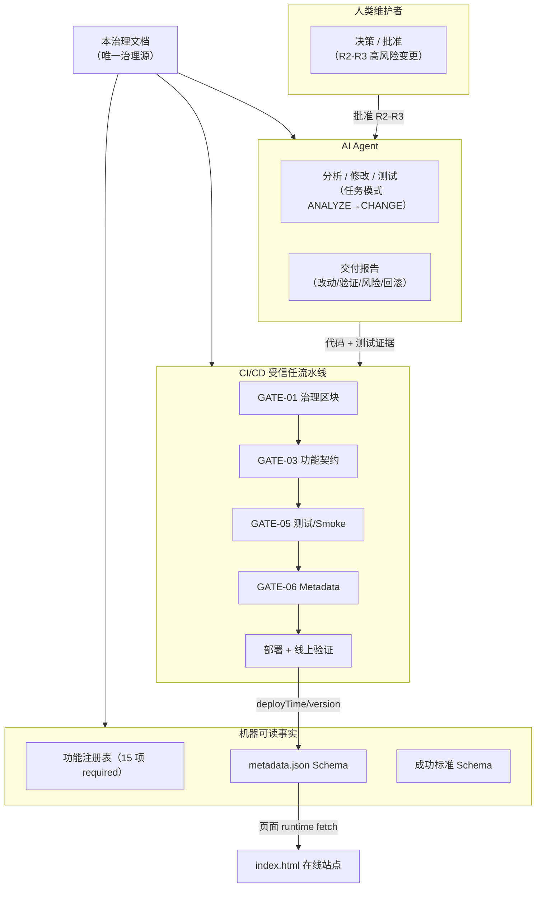
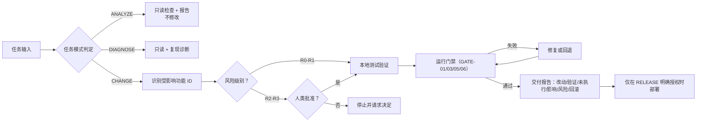
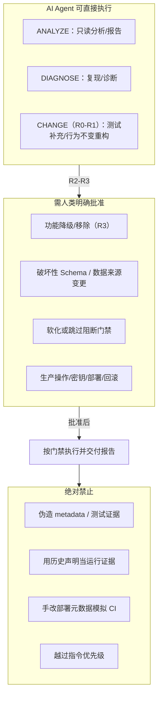
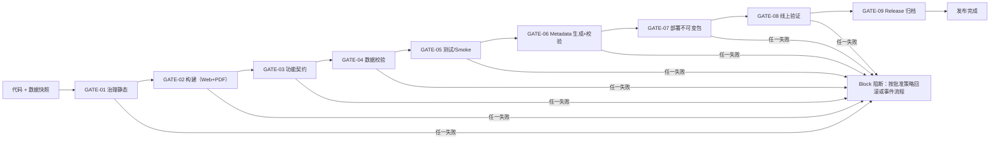

# 🐋 aircon-compare 统一治理与 AI 执行指南

> 文档版本：以 `AIRCON_AI_CONTEXT_V1.document.version` 为准（单文件、自包含版）  
> 文档状态：Living Document  
> 最后修订：2026-08-26  
> 适用对象：人类维护者、AI Agent、CI/CD、发布、部署、监控与回滚流程  
> 合并范围：本轮 7 个附件，逐字节去重后为 5 份唯一内容  
> 目标：把本文件单独交给 AI 时，AI 能准确区分“规范要求、历史声明、目标状态、当前事实与未知项”，并在取得证据后安全工作。
> **重要：** 本文件可以完整提供项目治理上下文，但不能替代对实际仓库、测试、CI 和线上环境的检查。任何没有现场证据的实现状态均为 `unknown`，不得猜测为“已完成”或“未实现”。

---

## 0. AI 必读执行契约

### 0.1 阅读要求

收到本文件的 AI 必须先完整阅读，再执行项目任务。不得只摘取“禁止事项”或某个 JSON 区块后跳过其余条件。

本文件中的信息分为六类：

| 标签 | 含义 | AI 应如何处理 |
| --- | --- | --- |
| `REQUIREMENT` | 已批准的规范要求 | 必须遵守；降低要求需走变更控制 |
| `HISTORICAL_CLAIM` | 旧文档曾作出的描述 | 只能作为调查线索；未验证前不得当作当前事实 |
| `TARGET_STATE` | 期望达到的架构或流程 | 不代表已经落地；必须检查实际仓库 |
| `OBSERVED` | 本次任务中由命令、测试或线上检查取得的证据 | 可用于当前结论，并应报告证据来源 |
| `UNKNOWN` | 尚无足够证据 | 必须检查或如实报告未知，不得补全想象 |
| `EXAMPLE` | 仅用于解释格式或流程的示例 | 不得复制为当前版本、日期、URL、哈希、记录数或实现事实 |

旧文档里的 `✅`、复选框、版本示例、时间示例和流程图都不构成完成证据。

### 0.2 指令优先级

本文件不得覆盖 AI 所在平台的系统、开发者、安全规则或当前用户明确指令。AI 应按照所在工具定义的正式指令优先级执行。对于项目内部资料，采用以下原则：

1. 当前任务的明确范围和授权；
2. 实际适用的仓库级指令文件；
3. 本治理文件的规范要求与内嵌机器块；
4. 经本文件生成且验证一致的投影文件；
5. 旧治理文档、历史建议、示例和未验证声明。

代码现状可以证明“当前实现与要求不一致”，但不能自动废除规范要求。

### 0.3 任务模式

AI 必须先判断任务模式，不得擅自扩大权限：

| 模式 | 用户意图 | 允许动作 |
| --- | --- | --- |
| `ANALYZE` | 分析、解释、评审、报告 | 只读检查并报告；不修改代码或外部状态 |
| `DIAGNOSE` | 定位原因 | 只读检查、复现和诊断；除非同时要求修复，否则不实现 |
| `CHANGE` | 修复、修改、构建 | 在请求范围内改动、测试和交付；不自动部署 |
| `RELEASE` | 明确要求发布或部署 | 通过受信任流水线执行，并完成部署后验证 |
| `ROLLBACK` | 明确要求恢复旧版本 / 数据 | 先解析精确目标与影响，再按回滚流程执行 |

“使用本指南”“继续处理”“优化一下”本身不构成生产部署、删除功能、发布 Release、修改权限或发送外部消息的授权。

### 0.4 认知防错硬规则

AI 必须遵守：

1. 不把目标目录树当作实际目录树；
2. 不把历史文件名当作当前实现路径；
3. 不把示例版本、日期、URL、哈希或记录数写入生产；
4. 不把 P0 / P1 / P2 当作完成状态；它们只表示优先级；
5. 不把功能“受保护”误读为功能“已实现且正常”；
6. 不把文件存在、函数名存在或页面文字存在当作行为正常；
7. 不把测试文件存在当作测试已运行或已通过；
8. 不把 CI 绿色当作线上部署已验证；
9. 不把 Hash 一致当作来源真实性已证明；
10. 不把用户要求修复代码扩展为重构整个治理体系；
11. 不在缺少仓库或线上访问时声称已修复、已部署、已同步或可回滚；
12. 不用静态旧值、占位符或猜测结果填补未知事实。

### 0.5 证据等级

| 等级 | 证据 | 可以支持的结论 |
| --- | --- | --- |
| E0 | 旧文档声明、注释、复选框 | 仅能提出调查线索 |
| E1 | 当前仓库静态检查、文件与配置 | 可以说明代码 / 配置现状，不能证明运行正确 |
| E2 | 本地自动化测试与数据校验实际通过 | 可以说明受测范围通过 |
| E3 | 受信任 CI 对指定 commit 的报告 | 可以说明该流水线及其范围通过 |
| E4 | 指定部署环境的元数据与行为验证 | 可以说明该部署在检查时满足相应条件 |

“已部署”至少需要 E4；“功能修复”至少需要相关 E2，若任务涉及生产则还需要 E3 与 E4。任何降级结论必须明确写出证据上限。

---

## 1. 自包含单一事实源

### 1.1 本文件的权威范围

本文件是 aircon-compare 唯一的项目治理源，并内嵌以下机器可读事实：

- AI 基础上下文；
- 受保护功能注册表；
- 功能注册表 Schema；
- 运行时 `metadata.json` Schema；
- 发布成功标准及其 Schema。

外部 `FEATURE_REGISTRY.json`、`feature-registry.schema.json`、`SUCCESS_CRITERIA.json`、`success-criteria.schema.json` 或 `metadata.schema.json` 如需存在，只能由本文件相应区块生成，属于**只读投影**，不得独立编辑。

唯一例外是部署产物中的 `metadata.json`：它记录某一次部署的运行时事实，由受信任流水线生成，并按本文内嵌 Schema 校验。

结构化清单、枚举与字段约束只以内嵌规范机器块为准；权限、流程与行为边界以规范正文为准。如果二者出现冲突，应视为文档缺陷并停止相关高风险动作，不得由 AI 选择对自己更方便的一项。

### 1.1.1 整体治理架构图



### 1.2 机器区块规则

规范性机器区块由唯一的 HTML 边界标记包围。提取器必须：

1. 按区块 ID 找到恰好一个 BEGIN 和一个 END；
2. 只接受二者之间恰好一个 `json` fenced block；
3. 严格 JSON 解析，拒绝注释、尾随逗号和重复键；
4. 校验区块自身的 `blockId`；
5. 任何缺失、重复、解析失败或投影漂移都以非零状态退出。

AI 不得编辑生成投影来规避修改本文件和相应评审。

### 1.3 AI 基础上下文

<!-- AIRCON:NORMATIVE:AI_CONTEXT_V1:BEGIN -->
```json
{
  "blockId": "AIRCON_AI_CONTEXT_V1",
  "schemaVersion": "1.0.0",
  "normative": true,
  "document": {
    "name": "AIRCON_COMPARE_GOVERNANCE.md",
    "version": "3.1.0",
    "versionScope": "governance-document",
    "status": "living"
  },
  "project": {
    "name": "aircon-compare",
    "purpose": "香港窗口式空调资料验证、搜索、筛选、排序、比较、分析与报告",
    "authoritativeDataPublisher": "Hong Kong Electrical and Mechanical Services Department (EMSD)",
    "expectedDeliveryChannels": [
      "web",
      "pdf"
    ]
  },
  "evidenceAtThisMerge": {
    "applicationRepositoryInspected": false,
    "liveSiteInspected": false,
    "ciRunsInspected": false,
    "currentProductVersionKnown": false,
    "currentImplementationState": "unknown"
  },
  "runtimeMetadataTarget": {
    "canonicalFile": "metadata.json",
    "legacyFilesToRetireAfterConsumerMigration": [
      "version.json",
      "last_deploy.json",
      "dataset.json"
    ],
    "state": "target_state_not_verified"
  },
  "mergeInputSummary": {
    "receivedFiles": 7,
    "uniqueContents": 5,
    "byteIdenticalDuplicateGroups": 2
  },
  "sourceLineage": [
    {
      "logicalName": "Enterprise AI Governance Framework",
      "sha256": "3bb8d5da45a4b44f465b6513c2ce4e4560e3323d4f6dd73e29c0612225891537",
      "identicalCopiesReceived": 2
    },
    {
      "logicalName": "AI Maintenance Guide / 优化建议和图表",
      "sha256": "f8ad877fe50e5b42f8ac067e99cb80c8fdf2fd1fa40ff7a19c1e260a876ca35e",
      "identicalCopiesReceived": 2
    },
    {
      "logicalName": "AIRCON_COMPARE_GOVERNANCE v2.0.0",
      "sha256": "49ec7bf62a9c7b7d0d06488ca0c5b174736fdac1f95f3fc0d930b6f6c7999812",
      "identicalCopiesReceived": 1
    },
    {
      "logicalName": "AIRCON_COMPARE_GOVERNANCE v3.0.0 candidate A (T-d6a915)",
      "sha256": "ffaa9c5179c044e52f1734f73c02c0014c386596268832af2d17f65c6fdd51dc",
      "identicalCopiesReceived": 1
    },
    {
      "logicalName": "AIRCON_COMPARE_GOVERNANCE v3.0.0 candidate B (T-13975f)",
      "sha256": "d369a372e2f6b7e01bf0eb19542007a08f8fc026a01225ca23781b368099c9be",
      "identicalCopiesReceived": 1
    }
  ],
  "historicalClaims": [
    {
      "id": "HIST-P0-LAST-DEPLOY",
      "priority": "P0",
      "claim": "Hero 的 Last Deploy Time 曾在 v1.2.6 存在，后续维护中被移除",
      "truthStatus": "historical_claim_unverified",
      "requiredNextStep": "inspect_repository_and_deployed_site"
    },
    {
      "id": "HIST-P0-LAST-UPDATE",
      "priority": "P0",
      "claim": "资料更新后页面 Last Update Time 仍使用静态日期",
      "truthStatus": "historical_claim_unverified",
      "requiredNextStep": "trace_dataset_date_from_source_to_ui_and_pdf"
    },
    {
      "id": "HIST-P1-METADATA",
      "priority": "P1",
      "claim": "统一版本、构建、部署与数据元数据链路尚未建立",
      "truthStatus": "historical_claim_unverified",
      "requiredNextStep": "inspect_runtime_metadata_and_ci_generation"
    },
    {
      "id": "HIST-P1-ARTIFACT",
      "priority": "P1",
      "claim": "缺少可长期取得的发布资产，因此回滚未被证明可执行",
      "truthStatus": "historical_claim_unverified",
      "requiredNextStep": "inspect_release_assets_retention_and_rollback_evidence"
    },
    {
      "id": "HIST-P2-DATASET-TRACKING",
      "priority": "P2",
      "claim": "资料快照追踪与原始 Hash 校验不完整",
      "truthStatus": "historical_claim_unverified",
      "requiredNextStep": "inspect_dataset_provenance_and_validation"
    }
  ]
}
```
<!-- AIRCON:NORMATIVE:AI_CONTEXT_V1:END -->

`evidenceAtThisMerge` 只描述合并本文时没有获得应用仓库、CI 与线上证据；未来 AI 每次工作仍必须重新检查实际环境，不能把该对象改成实时状态面板。

---

## 2. 项目术语与不可混用概念

| 术语 | 唯一定义 |
| --- | --- |
| 治理文档版本 | 本文件自身的版本，例如 `3.1.0`；与产品版本无关 |
| Product Version | 按 SemVer 管理的 aircon-compare 发布版本 |
| Build | 一次流水线内唯一且不可复用的构建标识 |
| Commit | 构建输入的完整 Git object ID |
| Deploy Time | 最终部署包在受信任生产作业中封包的 UTC 时间；只有成功部署的包在线可见 |
| Deployment Completion | 平台记录的部署完成事件，用于审计 `deployTime`，不由页面猜测 |
| Dataset Date | 本次展示数据的官方发布 / 生效日期；没有官方日期时才按已记录规则使用获取日期 |
| Dataset Retrieved At | 实际取得来源快照的 UTC 时间 |
| Last Deploy | UI 对 `metadata.json.deployTime` 的 HKT 显示 |
| Last Update | UI 对 `metadata.json.datasetDate` 的显示 |
| Priority | P0 / P1 / P2 的修复或保障优先级 |
| Protection | 功能是否允许被自主降级或移除；与 Priority 不同 |
| Implementation State | 根据当前仓库与运行证据得出的状态；本文建立时统一未知 |
| Release Payload Hash | 对不含最终 `metadata.json` 的不可变应用与数据负载计算的 SHA-256；最终归档包另存独立摘要 |
| Release Asset | 长期保留、带摘要、可追溯的不可变发布资产 |
| Actions Artifact | CI 临时产物；除非明确配置长期保留，否则不能等同于 Release Asset |

当仓库使用不同显示文案时，可以保留 UI 文案，但内部语义和数据来源必须与上表一致。

---

## 3. AI 启动与执行流程

### 3.1 启动检查

AI 每次接手任务必须按顺序完成：

1. 识别任务模式和明确授权；
2. 找到实际仓库根目录；如果没有仓库，只能处理文档或给出待验证方案；
3. 读取作用域内的 `AGENTS.md`、`CLAUDE.md`、Cursor / Copilot 规则等实际指令；
4. 查看工作区状态，保留用户已有修改，不覆盖无关工作；
5. 列出实际文件树和技术栈配置，不根据旧流程图猜文件名；
6. 读取本文件的全部规范区块，并验证 JSON 可解析；
7. 查找生成投影并与内嵌区块比较；不一致时报告漂移；
8. 对本次受影响功能建立“要求—当前证据—差距—测试”矩阵；
9. 评估数据、Schema、部署、权限与回滚风险；
10. 再开始范围内的修改。

### 3.2 当前状态判定

对每项相关要求，AI 必须使用以下状态之一：

- `unknown`：尚未检查；
- `present_unverified`：静态实现可能存在，但未运行；
- `verified_pass`：相关测试或部署检查已实际通过；
- `verified_fail`：有可复现失败证据；
- `not_applicable`：有明确理由不适用于当前任务；
- `blocked`：缺少权限、输入、环境或必要决定。

不得使用“看起来正常”“应该已经”“大概支持”等模糊状态。

### 3.3 文件不存在时

- 目标结构中的文件不存在，只能证明“该路径不存在”，不能证明相应功能不存在；
- 旧文档提到的 `fetch_emsd.py`、`verify_emsd.py`、`compare_emsd.py`、`generate_html.py`、`generate_pdf.py` 是历史建议路径，不保证当前仓库使用这些名称；
- 不得为了匹配流程图而擅自创建、移动或重命名文件；
- 只有当当前任务需要该治理组件时，才在实际技术栈中实现等价职责；
- 缺少 Registry 投影时，直接使用本文内嵌 Registry，不得重新发明功能清单。

### 3.4 修改前与修改后

修改前必须：

- 指出受影响的功能 ID；
- 对 Bug 建立复现步骤或失败测试；不能复现时说明；
- 确定最小改动范围；
- 确定实际可运行的验证命令，不凭空假设 `npm`、Python 或其他工具存在；
- 对高风险操作确认人类授权。

修改后必须：

- 运行与风险相称的静态、单元、集成、冒烟和数据检查；
- 如实列出实际命令、退出结果和未执行项目；
- 检查是否意外修改了受保护功能、生成文件或用户已有改动；
- 更新本次变更直接影响的 Changelog、测试、ADR 或规范区块；
- 不手改部署元数据来模拟 CI；
- 提供可执行回滚方案。

推荐路径：

```text
任务授权
  → 仓库发现
  → 事实与要求对齐
  → 最小范围修改
  → 自动化验证
  → 差异与风险复核
  → 交付报告
  → 仅在明确授权时发布 / 部署
```

### 3.5 AI Governance 流程图



---

## 4. 角色、权限与高风险边界

### 4.1 角色

| 角色 | 可执行职责 | 必须升级给人类维护者的事项 |
| --- | --- | --- |
| AI Agent | 分析、实现已授权改动、测试、记录证据与风险 | 功能降级、破坏性 Schema、生产权限、门禁例外 |
| 人类维护者 / Code Owner | 批准规范、功能状态、兼容性与高风险变更 | 不得绕过组织安全和审计要求 |
| CI | 确定性执行校验并保存报告 | 不得把关键失败伪装成警告或成功 |
| 发布工作流 | 生成元数据、封包、部署、验证、归档 | 不得执行来自不受信任 PR 的生产代码 |
| 事件负责人 | 分级、止损、回滚、沟通与复盘 | 不得混用未经兼容性验证的应用与数据 |

### 4.2 风险级别

| 级别 | 示例 | 最低要求 |
| --- | --- | --- |
| R0 | 只读分析、状态报告 | 引用证据，不修改代码或外部状态 |
| R1 | 文案、测试补充、行为不变的局部重构 | 相关测试、差异复核和可逆变更 |
| R2 | 用户行为、依赖、构建或数据转换变化 | 完整影响分析、行为测试、回滚方案和人类评审 |
| R3 | 功能降级、破坏性 Schema、生产权限、数据来源、部署或回滚架构 | 明确人类批准、ADR、兼容与迁移计划、全部适用门禁 |

风险级别描述变更的影响，不代表授权。即使是 R0，也不得超出当前任务范围；R2—R3 不得从“优化”“整理”或“修复”等宽泛措辞推定生产权限。

### 4.3 必须明确批准的事项

下列变更必须有人类明确批准：

- 降低、弃用或移除受保护功能；
- 改变 EMSD 来源、解析、标准化、Hash、字段语义、排名或推荐规则；
- 对 Registry、Metadata Schema 或数据契约作破坏性变更；
- 删除、跳过、软化 CI 阻断门禁；
- 操作生产、密钥、权限、Release、部署或回滚；
- 覆盖用户已有且与任务无关的工作区修改；
- 修改本文件硬性规则或建立例外。

AI 不得把“用户要求修 Bug”解释为上述批准。

### 4.4 AI Agent 权限模型



---

## 5. 规范性功能注册表

### 5.1 状态解释

本节只定义**最低保护要求**，不声称功能当前已经存在或正常。所有功能的实际状态必须按第 3.2 节重新取证。

<!-- AIRCON:NORMATIVE:FEATURE_REGISTRY_SCHEMA_V1:BEGIN -->
```json
{
  "$schema": "https://json-schema.org/draft/2020-12/schema",
  "$id": "urn:aircon-compare:feature-registry-schema:1.0.0",
  "blockId": "AIRCON_FEATURE_REGISTRY_SCHEMA_V1",
  "type": "object",
  "required": [
    "blockId",
    "schemaVersion",
    "provenance",
    "statusSemantics",
    "features"
  ],
  "additionalProperties": false,
  "properties": {
    "blockId": {
      "const": "AIRCON_FEATURE_REGISTRY_V1"
    },
    "schemaVersion": {
      "const": "1.0.0"
    },
    "provenance": {
      "type": "string",
      "minLength": 1
    },
    "statusSemantics": {
      "type": "object",
      "required": [
        "required",
        "optional",
        "deprecated",
        "removed"
      ],
      "additionalProperties": false,
      "properties": {
        "required": {
          "type": "string",
          "minLength": 1
        },
        "optional": {
          "type": "string",
          "minLength": 1
        },
        "deprecated": {
          "type": "string",
          "minLength": 1
        },
        "removed": {
          "type": "string",
          "minLength": 1
        }
      }
    },
    "features": {
      "type": "array",
      "minItems": 1,
      "items": {
        "type": "object",
        "required": [
          "id",
          "name",
          "aliases",
          "category",
          "priority",
          "protection",
          "testContract",
          "evidenceRequired",
          "testBindings"
        ],
        "additionalProperties": false,
        "properties": {
          "id": {
            "type": "string",
            "pattern": "^[a-z][a-z0-9]*(\\.[a-z][a-z0-9-]*)+$"
          },
          "name": {
            "type": "string",
            "minLength": 1
          },
          "aliases": {
            "type": "array",
            "items": {
              "type": "string",
              "minLength": 1
            },
            "uniqueItems": true
          },
          "category": {
            "enum": [
              "core",
              "data",
              "ui",
              "report",
              "operations"
            ]
          },
          "priority": {
            "enum": [
              "P0",
              "P1",
              "P2"
            ]
          },
          "protection": {
            "enum": [
              "required",
              "optional",
              "deprecated",
              "removed"
            ]
          },
          "testContract": {
            "type": "string",
            "minLength": 1
          },
          "evidenceRequired": {
            "type": "array",
            "minItems": 1,
            "uniqueItems": true,
            "items": {
              "enum": [
                "static_inspection",
                "automated_test",
                "browser_smoke",
                "deployed_observation",
                "data_integrity_report"
              ]
            }
          },
          "testBindings": {
            "type": "array",
            "items": {
              "type": "string",
              "minLength": 1
            },
            "uniqueItems": true
          }
        }
      }
    }
  }
}
```
<!-- AIRCON:NORMATIVE:FEATURE_REGISTRY_SCHEMA_V1:END -->

<!-- AIRCON:NORMATIVE:FEATURE_REGISTRY_V1:BEGIN -->
```json
{
  "blockId": "AIRCON_FEATURE_REGISTRY_V1",
  "schemaVersion": "1.0.0",
  "provenance": "两份原始治理文档功能条目的并集；实际实现状态在合并时未知",
  "statusSemantics": {
    "required": "AI 不得自行禁用、降级或移除；改变状态必须经过 Code Owner 和变更控制",
    "optional": "允许不存在，但如已实现仍不得在无授权时造成意外回归",
    "deprecated": "已批准弃用，必须有迁移期、目标版本和替代方案",
    "removed": "已按批准记录移除，仅保留历史与迁移证据"
  },
  "features": [
    {
      "id": "core.search",
      "name": "Search",
      "aliases": [
        "搜索"
      ],
      "category": "core",
      "priority": "P0",
      "protection": "required",
      "testContract": "用户可按仓库声明的品牌或型号匹配规则搜索；结果与当前数据快照一致，空结果与错误状态可理解",
      "evidenceRequired": [
        "automated_test",
        "browser_smoke"
      ],
      "testBindings": ["tests/browser_smoke.py::test_search_models"]
    },
    {
      "id": "core.filter",
      "name": "Filter",
      "aliases": [
        "筛选"
      ],
      "category": "core",
      "priority": "P0",
      "protection": "required",
      "testContract": "用户可按已声明规格和能效条件筛选；组合条件不会产生不符合条件或重复的结果",
      "evidenceRequired": [
        "automated_test",
        "browser_smoke"
      ],
      "testBindings": ["tests/browser_smoke.py::test_filter_brand"]
    },
    {
      "id": "core.sort",
      "name": "Sort",
      "aliases": [
        "排序"
      ],
      "category": "core",
      "priority": "P0",
      "protection": "required",
      "testContract": "用户可按已声明字段和方向排序；排序不丢失、不重复或静默改变数据记录",
      "evidenceRequired": [
        "automated_test",
        "browser_smoke"
      ],
      "testBindings": ["tests/browser_smoke.py::test_sort_price"]
    },
    {
      "id": "core.compare",
      "name": "Compare",
      "aliases": [
        "型号比较",
        "多型号对比"
      ],
      "category": "core",
      "priority": "P0",
      "protection": "required",
      "testContract": "用户可选择并比较多个型号；显示字段与同一数据快照中的原始记录一致",
      "evidenceRequired": [
        "automated_test",
        "browser_smoke"
      ],
      "testBindings": ["tests/browser_smoke.py::test_compare_modal"]
    },
    {
      "id": "ui.comparison-modal",
      "name": "Comparison Modal",
      "aliases": [
        "Compare Modal",
        "比较弹窗"
      ],
      "category": "ui",
      "priority": "P0",
      "protection": "required",
      "testContract": "比较弹窗可按界面约定打开、关闭与操作，内容与 Compare 状态一致，并保留基本键盘可用性",
      "evidenceRequired": [
        "automated_test",
        "browser_smoke"
      ],
      "testBindings": ["tests/browser_smoke.py::test_compare_modal"]
    },
    {
      "id": "ui.responsive",
      "name": "Responsive UI",
      "aliases": [
        "Mobile",
        "响应式界面"
      ],
      "category": "ui",
      "priority": "P0",
      "protection": "required",
      "testContract": "在仓库声明的桌面与移动断点上，核心控件可见、可操作且内容不发生阻断性溢出；若断点未定义，应报告治理缺口",
      "evidenceRequired": [
        "browser_smoke"
      ],
      "testBindings": ["tests/browser_smoke.py::test_responsive_no_overflow"]
    },
    {
      "id": "data.emsd-verification",
      "name": "EMSD Verification",
      "aliases": [
        "EMSD 官方资料验证"
      ],
      "category": "data",
      "priority": "P0",
      "protection": "required",
      "testContract": "只接受批准的 EMSD 来源，执行结构与完整性检查，并对不符合要求的资料以失败状态阻止发布",
      "evidenceRequired": [
        "automated_test",
        "data_integrity_report"
      ],
      "testBindings": ["tests/test_core.py::test_load_models_dedup"]
    },
    {
      "id": "core.ranking",
      "name": "Ranking",
      "aliases": [
        "排名分析"
      ],
      "category": "core",
      "priority": "P1",
      "protection": "required",
      "testContract": "对固定资料与规则产生可复现排名；使用的字段、排序方向和并列处理有代码或测试证据",
      "evidenceRequired": [
        "automated_test"
      ],
      "testBindings": ["tests/test_governance.py::test_ranking_recommendation_sections"]
    },
    {
      "id": "core.recommendation",
      "name": "Recommendation",
      "aliases": [
        "推荐系统"
      ],
      "category": "core",
      "priority": "P1",
      "protection": "required",
      "testContract": "推荐结果可追溯到已声明规则和当前资料，不生成资料中不存在的型号或规格",
      "evidenceRequired": [
        "automated_test"
      ],
      "testBindings": ["tests/test_governance.py::test_ranking_recommendation_sections"]
    },
    {
      "id": "report.pdf-export",
      "name": "PDF Export",
      "aliases": [
        "PDF 报告生成"
      ],
      "category": "report",
      "priority": "P1",
      "protection": "required",
      "testContract": "可生成能正常打开的 PDF；版本、数据日期与主要比较内容和 Web 使用同一发布输入",
      "evidenceRequired": [
        "automated_test"
      ],
      "testBindings": ["tests/test_governance.py::test_pdf_export"]
    },
    {
      "id": "operations.version-display",
      "name": "Version",
      "aliases": [
        "版本显示"
      ],
      "category": "operations",
      "priority": "P0",
      "protection": "required",
      "testContract": "页面版本只读取已部署 metadata.json.version，显示层可加 v 前缀但不得另设手工版本常量",
      "evidenceRequired": [
        "automated_test",
        "browser_smoke",
        "deployed_observation"
      ],
      "testBindings": ["tests/test_governance.py::test_version_single_source"]
    },
    {
      "id": "operations.last-deploy",
      "name": "Last Deploy Time",
      "aliases": [
        "Last Deploy",
        "最后部署时间"
      ],
      "category": "operations",
      "priority": "P0",
      "protection": "required",
      "testContract": "页面只读取已部署 metadata.json.deployTime，并以明确 HKT 时区显示；加载失败不得显示伪造或硬编码时间",
      "evidenceRequired": [
        "automated_test",
        "browser_smoke",
        "deployed_observation"
      ],
      "testBindings": ["tests/test_governance.py::test_format_status_metadata_driven"]
    },
    {
      "id": "operations.dataset-update",
      "name": "Last Update Time",
      "aliases": [
        "Dataset Date",
        "Dataset Update Date",
        "资料更新时间"
      ],
      "category": "operations",
      "priority": "P0",
      "protection": "required",
      "testContract": "Web 与 PDF 只读取本次发布 metadata.json.datasetDate，并与实际数据快照一致；不得维护静态副本",
      "evidenceRequired": [
        "automated_test",
        "browser_smoke",
        "data_integrity_report"
      ],
      "testBindings": ["tests/test_governance.py::test_format_status_metadata_driven"]
    },
    {
      "id": "operations.build-metadata",
      "name": "Build Metadata",
      "aliases": [
        "构建元数据"
      ],
      "category": "operations",
      "priority": "P0",
      "protection": "required",
      "testContract": "部署产物可追溯到唯一 build、完整 commit、workflow run、产品版本、部署时间、发布负载摘要与数据快照",
      "evidenceRequired": [
        "automated_test",
        "deployed_observation"
      ],
      "testBindings": ["tests/test_governance.py::test_metadata_generate_and_validate"]
    },
    {
      "id": "operations.github-pages-deploy",
      "name": "GitHub Pages Deploy",
      "aliases": [
        "GitHub Pages 部署"
      ],
      "category": "operations",
      "priority": "P0",
      "protection": "required",
      "testContract": "受信任工作流部署指定不可变包；目标 URL 可访问，线上元数据和核心行为与该包一致",
      "evidenceRequired": [
        "browser_smoke",
        "deployed_observation"
      ],
      "testBindings": ["tests/browser_smoke.py::test_search_models"]
    }
  ]
}
```
<!-- AIRCON:NORMATIVE:FEATURE_REGISTRY_V1:END -->

### 5.2 Registry 使用规则

- `testBindings` 在合并时为空，表示没有仓库证据，不表示可以不测试；
- AI 检查实际仓库后，可在经评审的治理变更中填写稳定测试 ID；
- 在测试绑定完成前，Feature Check 必须报告缺口，不能伪造测试名使门禁变绿；
- 功能状态从 `required` 降级必须有人类批准、ADR、迁移计划、SemVer 判断和回滚方案；
- 新功能必须先登记要求与测试契约，再进入生产；
- 源代码关键字扫描只能作为 E1，不可代替行为测试。

---

## 6. EMSD 数据治理

### 6.1 规范数据链路

```text
批准的 EMSD 官方来源
  → 保存不可变原始快照与响应证据
  → 解析、结构、字段、单位、重复、缺失、范围检查
  → 标准化与确定性转换
  → 比较、排名、推荐与报告
  → Web / PDF
  → metadata.json 记录实际快照身份
```

具体脚本、语言和目录必须从仓库发现。历史文档中的 Python 文件名只代表逻辑阶段。

### 6.2 每个数据快照必须记录

- 批准的 EMSD URL 或稳定来源标识；
- 官方发布 / 生效日期及其日期依据；
- UTC 获取时间；
- 原始响应字节的 SHA-256；
- 稳定快照 ID；
- 记录数、格式 / Schema 版本；
- 转换代码版本或可追溯 commit；
- 原始快照，或可合法且可靠重取该快照的官方版本标识。

Hash 只能证明字节一致，不能单独证明来源真实。

### 6.3 Dataset Check 必须验证

- 来源域名 / 标识在批准清单内；
- 文件可解析，必填字段、类型和单位符合实际数据契约；
- 唯一键无意外重复，关键字段无意外缺失；
- 数值范围合理，记录数异常变化触发已配置门禁；
- Hash 按原始字节计算且与发布元数据一致；
- 转换确定、可复现且不覆盖原始快照；
- Web、PDF 与元数据引用同一快照；
- 校验失败以非零状态阻止数据进入发布包。

字段、单位和异常阈值必须在仓库的 Schema / 配置与测试中定义；本文不猜测 EMSD 当前字段格式。

---

## 7. 规范性运行时元数据

### 7.1 元数据 Schema

旧 `version.json`、`last_deploy.json` 和 `dataset.json` 是迁移输入，不是目标并行来源。完成所有消费者迁移前不得提前删除；迁移完成后不得继续写入。

<!-- AIRCON:NORMATIVE:METADATA_SCHEMA_V1:BEGIN -->
```json
{
  "$schema": "https://json-schema.org/draft/2020-12/schema",
  "$id": "urn:aircon-compare:metadata-schema:1.0.0",
  "blockId": "AIRCON_METADATA_SCHEMA_V1",
  "title": "aircon-compare deployment metadata",
  "type": "object",
  "required": [
    "schemaVersion",
    "version",
    "build",
    "commit",
    "deployTime",
    "workflowRunId",
    "deploymentType",
    "releasePayloadHash",
    "datasetDate",
    "datasetDateBasis",
    "datasetRetrievedAt",
    "datasetSourceUrl",
    "datasetSnapshotId",
    "datasetHash",
    "recordCount"
  ],
  "additionalProperties": false,
  "properties": {
    "schemaVersion": {
      "const": "1.0.0"
    },
    "version": {
      "type": "string",
      "pattern": "^(0|[1-9][0-9]*)\\.(0|[1-9][0-9]*)\\.(0|[1-9][0-9]*)(?:-((?:0|[1-9][0-9]*|[0-9]*[A-Za-z-][0-9A-Za-z-]*)(?:\\.(?:0|[1-9][0-9]*|[0-9]*[A-Za-z-][0-9A-Za-z-]*))*))?(?:\\+([0-9A-Za-z-]+(?:\\.[0-9A-Za-z-]+)*))?$"
    },
    "build": {
      "type": "string",
      "minLength": 1,
      "maxLength": 128,
      "pattern": "^[A-Za-z0-9][A-Za-z0-9._-]*$"
    },
    "commit": {
      "type": "string",
      "pattern": "^(?:[0-9a-f]{40}|[0-9a-f]{64})$"
    },
    "deployTime": {
      "type": "string",
      "format": "date-time",
      "pattern": "Z$"
    },
    "workflowRunId": {
      "type": "string",
      "minLength": 1,
      "maxLength": 128
    },
    "deploymentType": {
      "enum": [
        "release",
        "hotfix",
        "rollback"
      ]
    },
    "releasePayloadHash": {
      "type": "string",
      "pattern": "^sha256:[0-9a-f]{64}$"
    },
    "rollbackOfBuild": {
      "type": "string",
      "minLength": 1,
      "maxLength": 128
    },
    "datasetDate": {
      "type": "string",
      "format": "date",
      "pattern": "^[0-9]{4}-[0-9]{2}-[0-9]{2}$"
    },
    "datasetDateBasis": {
      "enum": [
        "official-published-date",
        "official-effective-date",
        "retrieval-date-fallback"
      ]
    },
    "datasetRetrievedAt": {
      "type": "string",
      "format": "date-time",
      "pattern": "Z$"
    },
    "datasetSourceUrl": {
      "type": "string",
      "format": "uri"
    },
    "datasetSnapshotId": {
      "type": "string",
      "minLength": 1,
      "maxLength": 256
    },
    "datasetHash": {
      "type": "string",
      "pattern": "^sha256:[0-9a-f]{64}$"
    },
    "recordCount": {
      "type": "integer",
      "minimum": 1
    }
  },
  "allOf": [
    {
      "if": {
        "properties": {
          "deploymentType": {
            "const": "rollback"
          }
        },
        "required": [
          "deploymentType"
        ]
      },
      "then": {
        "required": [
          "rollbackOfBuild"
        ]
      }
    }
  ]
}
```
<!-- AIRCON:NORMATIVE:METADATA_SCHEMA_V1:END -->

### 7.2 生成、发布与读取

1. 生产 `metadata.json` 只能在受信任部署作业中生成；
2. 输入必须来自 tag / release version、完整 commit、workflow run 和通过校验的数据报告；
3. `releasePayloadHash` 必须对不含最终 `metadata.json` 的不可变应用与数据负载计算 SHA-256，避免自引用；最终归档包另存独立摘要；
4. `deployTime` 在最终部署包封装前以 UTC 生成，不接受开发者手填；
5. 生成后必须以支持 JSON Schema Draft 2020-12 且启用 format 校验的验证器检查；
6. 只有成功部署的新包在线可见；失败部署不得覆盖上一次成功包；
7. 页面、PDF 和监控只读取该部署包的同一份元数据；
8. Last Deploy 将 UTC 转换为 `Asia/Hong_Kong`，并显示 HKT；
9. Last Update 显示 `datasetDate`，不得显示 `datasetRetrievedAt` 冒充官方资料日期；
10. 加载失败时显示“暂不可用”并上报，不得回退到硬编码旧值；
11. 必须有缓存失效策略，部署后验证要读取当前包而非 CDN 旧缓存；
12. Metadata 生成、Schema、显示同步或线上比对失败均为阻断性失败。

### 7.3 回滚元数据

回滚复用已验证的旧发布负载和兼容数据快照，但通过当前受信任工作流生成新的元数据：

- `version` 可为被恢复的旧产品版本；
- `deployTime` 是本次回滚部署的 UTC 时间；
- `deploymentType` 为 `rollback`；
- `rollbackOfBuild` 指向被撤回的构建；
- `releasePayloadHash` 反映实际恢复的应用与数据负载；
- 所有 dataset 字段反映实际回滚后快照。

不得整包复用旧 `metadata.json`，否则 Last Deploy 会错误显示原始发布时间。

---

## 8. 版本、发布资产与 Changelog

### 8.1 SemVer

产品采用 `MAJOR.MINOR.PATCH`：

- MAJOR：不兼容的 API、数据契约、URL、交互或部署要求；
- MINOR：向后兼容的新功能；
- PATCH：向后兼容的修复和内部改进。

代码量不是 Major 的判断依据。显示可加 `v`，元数据 `version` 不带 `v`。产品版本不得在 Hero、Footer、README、PDF 和脚本中多点手工维护。

### 8.2 Changelog

实际仓库的 Changelog 是变更历史证据，必须在仓库中检查；本文件不假设它存在或完整。若采用 `CHANGELOG.md`，应遵循一致的 Keep a Changelog 风格，开发内容进入 `Unreleased`，发布时归档到实际版本。

### 8.3 发布资产

每个生产发布应长期保存：

- 与线上一致的 Web 负载与 PDF；
- 使用的数据快照或稳定合法的快照引用；
- `metadata.json`；
- 测试、数据和 Schema 校验报告；
- 发布负载与数据快照的独立 SHA-256；
- tag、完整 commit、workflow run、审批与 Deployment 记录。

默认会过期的临时 CI Artifact 不能单独证明可回滚。应使用 GitHub Release assets 或具有明确保留、访问和完整性策略的不可变存储。

---

## 9. CI/CD 与防回归门禁

### 9.1 抽象阶段

| Gate ID | 阶段 | 必须检查 | 失败处理 |
| --- | --- | --- | --- |
| GATE-01 | Governance / Static | 规范区块可提取、JSON 与 Schema 有效、投影无漂移、语法和依赖策略 | Block |
| GATE-02 | Build | 以仓库声明命令可重复生成 Web 与 PDF | Block |
| GATE-03 | Feature Contract | required 功能有有效测试绑定，测试真实执行 | Block |
| GATE-04 | Dataset | 来源、结构、日期依据、记录数、快照与原始 Hash 有效 | Block |
| GATE-05 | Test / Smoke | 单元、集成、浏览器核心路径、响应式与 PDF | Block |
| GATE-06 | Metadata / Package | 受信任环境生成并校验唯一元数据，封装指定部署包 | Block |
| GATE-07 | Deploy | 受保护环境部署确切的不可变包 | Block |
| GATE-08 | Post-deploy | 线上可达、元数据匹配、核心行为与显示值正确 | Block；按批准策略回滚或进入事件流程 |
| GATE-09 | Release Archive | 资产、Hash、报告、tag 与 Changelog 可追溯 | 不得标记发布完成 |

不存在“关键 Metadata 失败但仅警告”的合规路径。

### 9.1.1 DevOps Governance 流水线图



### 9.2 Feature Check

Feature Check 必须：

1. 提取并按 Schema 校验 Registry；
2. 检查 ID 唯一、Protection 合法；
3. 解析实际测试清单；
4. 证明每个 required 功能绑定到存在且非空的测试；
5. 实际运行相关测试并输出 JUnit、JSON 或等价机器报告；
6. 把 skip、only、空断言、吞异常和总是成功视为失败或经批准例外；
7. 以浏览器测试覆盖用户可见 P0 路径；
8. 只把代码扫描作为辅助 E1 证据；
9. 任一缺失、漂移或失败返回非零状态。

### 9.3 PR 与生产边界

- PR 可运行静态、构建、Feature、Dataset 和测试门禁，但使用明确标记的测试元数据；
- 只有受保护分支 / tag 的受信任工作流可以生成生产元数据并访问生产环境；
- fork 或不受信任 PR 的代码不得在生产权限上下文中执行；
- 权限最小化，第三方 Actions 固定到已审查的完整 commit；
- 生产 Environment 使用并发控制和项目要求的人工审批；
- AI 不得臆造命令名；应从 `package.json`、锁文件、Makefile、任务配置和现有 Workflow 发现实际命令。

---

## 10. 规范性成功标准

以下 `baselineEvidenceState` 是文档合并时的状态，不是每次发布的实时结论。实际通过状态必须来自相应运行证据。

<!-- AIRCON:NORMATIVE:SUCCESS_CRITERIA_SCHEMA_V1:BEGIN -->
```json
{
  "$schema": "https://json-schema.org/draft/2020-12/schema",
  "$id": "urn:aircon-compare:success-criteria-schema:1.0.0",
  "blockId": "AIRCON_SUCCESS_CRITERIA_SCHEMA_V1",
  "type": "object",
  "required": [
    "blockId",
    "schemaVersion",
    "baselineEvidenceState",
    "criteria"
  ],
  "additionalProperties": false,
  "properties": {
    "blockId": {
      "const": "AIRCON_SUCCESS_CRITERIA_V1"
    },
    "schemaVersion": {
      "const": "1.0.0"
    },
    "baselineEvidenceState": {
      "const": "unverified"
    },
    "criteria": {
      "type": "array",
      "minItems": 1,
      "items": {
        "type": "object",
        "required": [
          "id",
          "priority",
          "gateScope",
          "blocking",
          "passCondition",
          "requiredEvidence"
        ],
        "additionalProperties": false,
        "properties": {
          "id": {
            "type": "string",
            "pattern": "^SC-[0-9]{3}-[A-Z0-9-]+$"
          },
          "priority": {
            "enum": [
              "P0",
              "P1",
              "P2"
            ]
          },
          "gateScope": {
            "enum": [
              "every-change",
              "production-release",
              "dataset-change",
              "governance-adoption",
              "scheduled"
            ]
          },
          "blocking": {
            "const": true
          },
          "passCondition": {
            "type": "string",
            "minLength": 1
          },
          "requiredEvidence": {
            "type": "array",
            "minItems": 1,
            "uniqueItems": true,
            "items": {
              "type": "string",
              "pattern": "^[a-z][a-z0-9_]*$"
            }
          }
        }
      }
    }
  }
}
```
<!-- AIRCON:NORMATIVE:SUCCESS_CRITERIA_SCHEMA_V1:END -->

<!-- AIRCON:NORMATIVE:SUCCESS_CRITERIA_V1:BEGIN -->
```json
{
  "blockId": "AIRCON_SUCCESS_CRITERIA_V1",
  "schemaVersion": "1.0.0",
  "baselineEvidenceState": "unverified",
  "criteria": [
    {
      "id": "SC-001-PROTECTED-FEATURES",
      "priority": "P0",
      "gateScope": "every-change",
      "blocking": true,
      "passCondition": "所有受影响 required 功能均有有效测试绑定且相应测试实际通过",
      "requiredEvidence": [
        "feature_check_report",
        "test_report"
      ]
    },
    {
      "id": "SC-002-LAST-DEPLOY",
      "priority": "P0",
      "gateScope": "production-release",
      "blocking": true,
      "passCondition": "线上 Last Deploy 读取当前 metadata.json.deployTime，以 HKT 显示并与本次 Deployment 对应",
      "requiredEvidence": [
        "metadata_schema_report",
        "deployed_metadata_observation",
        "browser_smoke_report"
      ]
    },
    {
      "id": "SC-003-LAST-UPDATE",
      "priority": "P0",
      "gateScope": "production-release",
      "blocking": true,
      "passCondition": "Web、PDF 与 metadata.json.datasetDate 使用同一已验证数据快照且不存在静态旧值",
      "requiredEvidence": [
        "data_integrity_report",
        "browser_smoke_report",
        "pdf_check_if_applicable"
      ]
    },
    {
      "id": "SC-004-UNIFIED-METADATA",
      "priority": "P0",
      "gateScope": "production-release",
      "blocking": true,
      "passCondition": "部署包只有一个运行时 metadata.json 事实源，Schema 校验通过，旧文件无活动写入消费者",
      "requiredEvidence": [
        "metadata_schema_report",
        "consumer_trace",
        "deployed_metadata_observation"
      ]
    },
    {
      "id": "SC-005-DATASET-PROVENANCE",
      "priority": "P0",
      "gateScope": "dataset-change",
      "blocking": true,
      "passCondition": "EMSD 来源、日期依据、获取时间、快照 ID、记录数和原始 SHA-256 均有效且可追溯",
      "requiredEvidence": [
        "data_integrity_report",
        "snapshot_provenance"
      ]
    },
    {
      "id": "SC-006-CI-GATES",
      "priority": "P0",
      "gateScope": "production-release",
      "blocking": true,
      "passCondition": "适用的 Governance、Build、Feature、Dataset、Test、Metadata 与 Smoke 门禁均实际通过且没有未批准 skip",
      "requiredEvidence": [
        "trusted_ci_run"
      ]
    },
    {
      "id": "SC-007-POST-DEPLOY",
      "priority": "P0",
      "gateScope": "production-release",
      "blocking": true,
      "passCondition": "线上 version、build、commit、workflow run、releasePayloadHash、数据快照与部署工作流预期一致，核心用户路径通过",
      "requiredEvidence": [
        "deployed_metadata_observation",
        "post_deploy_smoke_report"
      ]
    },
    {
      "id": "SC-008-RELEASE-ASSETS",
      "priority": "P1",
      "gateScope": "production-release",
      "blocking": true,
      "passCondition": "不可变发布负载、数据引用、元数据、Hash 与测试证据已保存到有明确保留策略的位置",
      "requiredEvidence": [
        "release_asset_inventory",
        "checksum_report"
      ]
    },
    {
      "id": "SC-009-ROLLBACK-DRILL",
      "priority": "P1",
      "gateScope": "governance-adoption",
      "blocking": true,
      "passCondition": "至少一次应用恢复和一次数据恢复演练成功，结果与限制有审计记录",
      "requiredEvidence": [
        "rollback_drill_report"
      ]
    },
    {
      "id": "SC-010-AI-ENTRYPOINTS",
      "priority": "P1",
      "gateScope": "governance-adoption",
      "blocking": true,
      "passCondition": "实际使用的 AI 工具入口均指向本文件，重复规则由同一模板生成且无漂移",
      "requiredEvidence": [
        "entrypoint_inventory",
        "drift_check_report"
      ]
    },
    {
      "id": "SC-011-TRACEABILITY",
      "priority": "P1",
      "gateScope": "production-release",
      "blocking": true,
      "passCondition": "产品版本、Changelog、tag、完整 commit、workflow run、releasePayloadHash、Deployment 与线上元数据可以互相追溯",
      "requiredEvidence": [
        "release_traceability_report"
      ]
    },
    {
      "id": "SC-012-GOVERNANCE-BLOCKS",
      "priority": "P0",
      "gateScope": "every-change",
      "blocking": true,
      "passCondition": "六个内嵌规范块唯一、可解析，Registry 与 Success Criteria 通过各自 Schema、区块 ID 和唯一 ID 检查",
      "requiredEvidence": [
        "governance_block_validation"
      ]
    },
    {
      "id": "SC-013-TEST-INTEGRITY",
      "priority": "P0",
      "gateScope": "every-change",
      "blocking": true,
      "passCondition": "适用的阻断测试不存在未批准的 skip、only、空断言、吞异常、恒成功实现或软化失败语义",
      "requiredEvidence": [
        "test_integrity_report"
      ]
    },
    {
      "id": "SC-014-REPRODUCIBLE-BUILD",
      "priority": "P0",
      "gateScope": "production-release",
      "blocking": true,
      "passCondition": "Web、静态资源与 required PDF 可从声明输入重复构建，候选负载摘要已记录",
      "requiredEvidence": [
        "build_report",
        "release_payload_checksum"
      ]
    },
    {
      "id": "SC-015-TRUST-BOUNDARY",
      "priority": "P0",
      "gateScope": "production-release",
      "blocking": true,
      "passCondition": "生产部署仅由受保护分支或 tag 的受信任作业执行，权限最小且不执行不受信任 PR 代码",
      "requiredEvidence": [
        "workflow_trust_policy_report"
      ]
    },
    {
      "id": "SC-016-AI-REPORT",
      "priority": "P1",
      "gateScope": "every-change",
      "blocking": true,
      "passCondition": "AI 交付报告区分事实类别和证据等级，并列出改动、实际验证、未执行项、功能与数据影响、风险及回滚",
      "requiredEvidence": [
        "ai_change_report_review"
      ]
    }
  ]
}
```
<!-- AIRCON:NORMATIVE:SUCCESS_CRITERIA_V1:END -->

未建立自动证据前，可以记录治理缺口，但不得把人工推测填成通过。人工证据必须包含负责人、时间、范围、结果和可访问链接。

---

## 11. 部署后验证、监控与回滚

### 11.1 部署后验证

发布只有在以下检查完成后才算成功：

- 首页、核心静态资源、`metadata.json` 和 PDF 可访问；
- 线上 version、build、commit、workflow run、releasePayloadHash 与当前流水线完全一致；
- Version、Last Deploy、Last Update 的 UI 值来自同一线上元数据；
- Registry 中 P0 / required 的浏览器路径通过；
- Web 与 PDF 的资料快照身份一致；
- 缓存没有返回旧元数据；
- 失败已触发告警并进入批准的回滚或事件流程。

### 11.2 最低监控

| 监控域 | 最低检查 |
| --- | --- |
| 可用性 | 首页、关键资源、元数据、PDF |
| 部署一致性 | 线上 version / build / commit / workflow run / releasePayloadHash |
| 功能 | required 核心用户路径定期冒烟 |
| 数据 | 来源、日期依据、记录数、Hash、Schema 与显示同步 |
| 新鲜度 | Dataset Date 超过项目配置阈值 |
| 回滚资产 | 最近已知良好资产仍可取得且摘要有效 |

频率、阈值、接收者和静默规则属于实际监控配置，AI 必须检查而非猜测。

### 11.3 回滚级别

| 级别 | 范围 | 受控做法 |
| --- | --- | --- |
| L1 | 小范围代码 / UI 缺陷 | Revert 或 Hotfix，发布新 Patch，完整走 CI |
| L2 | 应用发布故障 | 选择已知良好不可变负载，生成新回滚元数据后部署 |
| L3 | 数据快照故障 | 校验兼容性后恢复已验证旧快照 |
| L4 | 应用与数据 / 全站故障 | 恢复经过验证的兼容应用、数据和配置组合 |

可变分支不是回滚依据。目标必须由 tag、commit、发布摘要和数据快照 ID 唯一确定。

### 11.4 回滚步骤

1. 明确事故、负责人、影响与发布冻结范围；
2. 选择最近已知良好且证据完整的目标；
3. 校验资产 Hash、Schema 和应用—数据兼容性；
4. 通过受信任工作流生成新回滚元数据；
5. 部署并运行与正常发布相同的线上验证；
6. 监控恢复并记录实际结果；
7. 更新事件记录、Changelog / Issue，完成根因与防复发措施。

没有可取得资产、数据快照和成功演练时，不得宣称 L2—L4 可执行。

---

## 12. 历史问题与路线图的正确解释

### 12.1 历史问题

规范性上下文块中的五个 `historicalClaims` 均为调查入口，不是当前 Issue 状态。AI 必须：

1. 在实际仓库、CI、Release 和线上环境分别取证；
2. 将结果标记为 `verified_pass`、`verified_fail`、`blocked` 或 `unknown`；
3. 提供具体文件、测试、run 或 URL 证据；
4. 只有当前任务授权修复时才实施修复；
5. 将持续状态放入 Issue Tracker，不在本文复制实时状态。

### 12.2 旧路线图

旧文档曾建议：

- Phase 1：Last Deploy、Version Metadata、Smoke Test；
- Phase 2：Release Automation、Artifact Archive、Dataset Hash；
- Phase 3：Monitoring、Alert、Auto Issue；
- Phase 4：AI Assisted Maintenance、AI Governance、Self-healing Pipeline。

这些是 `HISTORICAL_CLAIM / TARGET_STATE`，不是已批准的当前工作队列，也不代表已完成。尤其 Auto Issue、告警发送、自愈和自动回滚会改变外部状态，必须有明确授权、权限边界、速率限制、幂等与人工接管方案。

---

## 13. AI 工具入口

`AGENTS.md` 不是所有工具的通用入口。应按实际工具版本建立薄入口：

| 工具 | 常见项目入口 |
| --- | --- |
| 支持 AGENTS.md 的 Agent | `AGENTS.md` |
| Claude Code | `CLAUDE.md` |
| Cursor | `.cursor/rules/governance.mdc`；旧版本才使用 `.cursorrules` |
| GitHub Copilot | `.github/copilot-instructions.md` |
| 其他 | 使用该工具当前正式机制并验证确实加载 |

入口只应引导读取本文件，不复制全部规则。最小语义如下：

```text
修改前完整读取 docs/AIRCON_COMPARE_GOVERNANCE.md。
先识别任务模式、检查实际仓库并区分 requirement / historical claim / target / observed / unknown。
不得自主降低 required 功能，不得伪造元数据与测试证据，不得绕过阻断门禁。
完成后报告改动、证据、测试、未知项、风险与回滚。
规则冲突或缺少高风险授权时停止相关动作并请求决定。
```

如果多个工具需要重复入口文本，应从一个模板生成并由漂移检查验证。入口机制随工具版本变化，必须现场确认。

---

## 14. AI 交付报告格式

每次完成任务，AI 的最终报告必须包含适用项目：

1. **结果：** 完成了什么；是否达到请求目标；
2. **事实依据：** 使用了哪些 E1—E4 证据；
3. **改动文件：** 精确路径和用途；
4. **验证：** 实际执行命令、测试数、结果和退出状态；
5. **未验证 / 未执行：** 原因及其影响；
6. **功能影响：** 相关 Registry ID，是否有行为或兼容性变化；
7. **数据影响：** 快照、日期、Hash 或转换是否变化；
8. **发布状态：** 未部署、已部署或部署受阻；不得省略环境；
9. **风险与回滚：** 剩余风险及可执行恢复方式；
10. **需要人类决定：** 仅列真正阻断或需额外授权的事项。

不得只输出“已优化”“测试通过”“应该没问题”等无证据总结。

---

## 15. 变更控制与例外

### 15.1 治理变更

修改本文或任一规范机器块必须：

- 通过 PR 与 Code Owner 审批；
- 解释动机、兼容性、迁移与风险；
- 同步提取器、生成投影和测试；
- 更新治理文档版本与实际 Changelog；
- 验证所有机器块和内部引用；
- 不得在同一提交中悄悄降低门禁。

### 15.2 ADR

功能移除、破坏性 Schema、资料来源更换、部署架构更换、权限变化和回滚策略变化必须建立 ADR，记录背景、决定、替代方案、后果、批准人和日期。

### 15.3 临时例外

每个例外必须包含唯一 ID、范围、理由、风险、补偿控制、验证方法、人类批准人、生效 / 到期时间、恢复负责人和 Issue。到期必须自动失效。

AI 不能批准涉及 P0 功能、资料真实性、凭据安全、生产权限或部署证据的例外。

---

## 16. 自包含文档的仓库落地

### 16.1 推荐目标结构

下列是 `TARGET_STATE`，不是对当前仓库的描述：

```text
aircon-compare/
├── docs/
│   ├── AIRCON_COMPARE_GOVERNANCE.md       # 唯一可编辑治理源
│   ├── CHANGELOG.md                       # 实际变更历史
│   ├── generated/
│   │   ├── FEATURE_REGISTRY.json          # 从本文提取
│   │   ├── feature-registry.schema.json   # 从本文提取
│   │   ├── SUCCESS_CRITERIA.json          # 从本文提取
│   │   ├── success-criteria.schema.json   # 从本文提取
│   │   └── metadata.schema.json           # 从本文提取
│   └── adr/
├── scripts/
│   ├── extract-governance.*               # 提取并验证唯一机器块
│   ├── feature-check.*
│   ├── dataset-check.*
│   ├── gen-metadata.*
│   └── validate-metadata.*
├── tests/
│   └── smoke/
├── AGENTS.md                              # 如实际工具支持
├── CLAUDE.md                              # 如实际使用 Claude Code
├── .cursor/rules/governance.mdc           # 如实际使用 Cursor
├── .github/
│   ├── copilot-instructions.md
│   └── workflows/
└── DEPLOYMENT_ARTIFACT_ROOT/              # 逻辑名；从实际构建配置解析
    ├── index.html
    ├── report.pdf                         # 受保护输出；变更需走功能状态控制
    └── metadata.json                      # 部署运行时事实
```

脚本扩展名、构建目录和 Workflow 文件名由实际技术栈决定。

### 16.2 首次落地步骤

- [ ] 把本文放到仓库并由 Code Owner 批准为治理源；
- [ ] 实现确定性区块提取与 JSON / Schema 校验；
- [ ] 将任何现有外部 Registry、Schema、成功标准与本文逐项对齐，不盲目覆盖；
- [ ] 为 Registry 的 required 功能绑定实际测试 ID；
- [ ] 追踪并迁移旧三个元数据文件的所有消费者；
- [ ] 修复经取证确认的 P0；
- [ ] 建立 CI 阻断门禁和部署后检查；
- [ ] 保存长期 Release assets 并完成应用、数据回滚演练；
- [ ] 建立实际 AI 工具入口与漂移检查；
- [ ] 归档旧治理文档，避免它们继续被 AI 当作并行指令。

---

## 17. 发布与回归核对表

### 发布前

- [ ] 已确认任务 / 发布授权与目标环境；
- [ ] 规范机器块可提取、可解析并通过 Schema；
- [ ] 生成投影与本文一致；
- [ ] required 功能测试绑定完整且实际通过；
- [ ] EMSD 来源、日期依据、快照、记录数与原始 Hash 通过；
- [ ] Web、响应式界面与 PDF 构建 / 冒烟通过；
- [ ] SemVer、Changelog、兼容性与回滚目标已评审；
- [ ] 没有未批准 skip 或软化门禁。

### 部署时

- [ ] 由受信任作业生成唯一 `metadata.json`；
- [ ] Metadata Schema 和 format 校验通过；
- [ ] 精确部署包、数据快照与摘要已确定；
- [ ] 生产权限、Environment、审批与并发控制正确；
- [ ] 长期发布资产和证据保存成功。

### 部署后

- [ ] 线上 version、build、commit、workflow run、releasePayloadHash 与预期一致；
- [ ] Last Deploy 和 Last Update 的来源、显示与时区正确；
- [ ] P0 / required 核心用户路径通过；
- [ ] Web、PDF 与资料快照一致；
- [ ] 缓存未返回旧元数据；
- [ ] 监控无新增严重告警；
- [ ] 回滚目标仍可取得且摘要有效。

---

## 18. 原文件信息覆盖、冲突裁决与去重记录

### 18.1 去重结论

逐字节比较确认：本轮共收到 7 个附件，实际为 5 份唯一内容；两组重复副本只计一次。规范性 SHA-256 与副本数只保存在 `AIRCON_AI_CONTEXT_V1.sourceLineage`，避免在同一文件内维护第二份可漂移哈希表。

| 本轮物理文件 | 去重与角色 |
| --- | --- |
| `input-01`、`input-06` | 字节相同；原《Enterprise AI Governance Framework》 |
| `input-02`、`input-07` | 字节相同；原《AI Maintenance Guide / 优化建议和图表》 |
| `input-05` | v2.0.0 合并重构稿 |
| `input-03` | v3.0.0 候选 A：证据等级、自包含上下文和规范块较完整 |
| `input-04` | v3.0.0 候选 B：风险分级、冲突裁决和发布负载摘要较明确 |

本 v3.1.0 吸收五份唯一内容；重复附件不重复形成要求，两份 v3 候选也不互相覆盖，而是按保守、可验证和单一事实源原则统一。

### 18.2 内容覆盖矩阵

| 原内容 | 本版位置 | 处理方式 |
| --- | --- | --- |
| 愿景、AI 使命与禁止事项 | 第 0、3、4 节 | 改为任务模式、证据等级、风险分级和可执行硬规则 |
| 核心 / 系统 / 受保护功能 | 第 5 节 Registry | 取原始资料并集，明确“要求不等于实现状态” |
| 系统架构与数据流 | 第 6、16 节 | 保留逻辑阶段，移除对未验证脚本路径的假设 |
| 三份旧元数据建议 | 第 7 节 | 迁移为单一运行时元数据，并提供完整 Schema |
| Version Flow 与 Hero 显示 | 第 2、7、8 节 | 统一术语、UTC 存储、HKT 显示，不保留示例当前值 |
| CI/CD 与 Feature Check | 第 9 节 | 从关键字扫描提升到 Registry—测试—行为证据 |
| Smoke Test / Success Criteria | 第 5、10、17 节 | 形成机器标准并明确证据范围 |
| Release、Artifact 与 Rollback | 第 7、8、11 节 | 使用负载摘要、不可变资产和新回滚元数据 |
| Monitoring | 第 11 节 | 明确最低监控与未知阈值处理 |
| 已知问题、Maintenance Tasks | 第 1、12、16 节 | 全部标记历史声明，要求现场验证 |
| Roadmap / Self-healing | 第 12 节 | 保留为非授权历史建议，限制外部副作用 |
| AI 检查提示词 | 第 0、3、14 节 | 改为稳定执行与报告协议 |
| 多 AI 自动加载 | 第 13 节 | 按工具入口区分，不误称 AGENTS.md 通用 |
| 图标标准 | 第 18.4 节 | 保留为非规范性视觉偏好 |
| v2.0 单一事实源改进 | 第 1、5、7、10 节 | 进一步改为单 Markdown 内嵌机器块，避免交接缺文件 |
| 两份 v3 候选 | 全文，重点为第 0、1、4、7、18 节 | 合并证据模型、自包含血缘、风险级别、负载摘要和冲突表 |

### 18.3 冲突与歧义的统一裁决

| 原资料冲突 / 歧义 | 本版唯一解释 |
| --- | --- |
| 7 个附件看似 7 份独立要求 | 实际为 5 份唯一内容；两组字节相同副本只计一次 |
| 功能清单与 Protected 清单范围不同 | 采用原始功能并集，15 项先作为 `required` 要求；实现状态仍须现场验证 |
| 功能前出现 `✅` 或已勾选清单 | 只表示历史文档列出该项，不构成存在、正常或测试通过证据 |
| Registry、Schema、Success Criteria 分散在外部文件 | 本 Markdown 内嵌规范块是唯一可编辑来源；外部 JSON 只能生成 |
| `version.json`、`last_deploy.json`、`dataset.json` 并行 | 目标只使用一个运行时 `metadata.json`；消费者迁移完成前不得提前删除旧文件 |
| Build 示例同时使用数字与字符串 | Schema 统一为非空受限字符串，迁移前检查真实消费者 |
| Deploy Time 使用 HKT 文本或 ISO 时间 | 存储 UTC RFC 3339 `Z`；UI 转换并明确显示 HKT |
| Dataset Date 含义不清 | 必须同时记录 `datasetDateBasis`，区分官方发布日期、生效日期和获取日期回退 |
| Metadata 失败可降为 warning | 统一为阻断性失败 |
| Feature Check 只扫描代码文字 | 扫描只算 E1 线索；有效行为测试和实际执行结果才可证明通过 |
| 回滚依赖“切旧分支” | 使用不可变负载、独立摘要、tag / commit 和兼容数据快照 |
| 所有 AI 自动读取 `AGENTS.md` | 不成立；按工具正式机制建立薄入口并验证确实加载 |
| “有明确需求即可删除功能” | 必须明确授权具体 Feature 状态变化，并走 R3 变更控制 |
| Python 文件名与 Node / npm 流程同时出现 | 都是历史或目标线索；先检查当前技术栈 |
| v1.2.6 后字段遗失 | 仅为未验证历史报告，必须在当前仓库或线上复现 |
| 文档日期、版本、URL、Hash、记录数示例 | 一律为 `EXAMPLE`，绝不转写为产品或部署事实 |
| 两份 v3 的 Metadata Schema 字段不同 | 采用保守并集：保留快照 ID、回滚关联和 hotfix，并增加非自引用 `releasePayloadHash` |

### 18.4 非规范性图标偏好

旧文档包含以下 UI / 文档图标建议。它们不属于验收标准，不得被 AI 当作必须加入页面的功能：

| 模块 | 建议图标 | 模块 | 建议图标 |
| --- | ---: | --- | ---: |
| EMSD | 🏛️ | Download | 📥 |
| Verify | ✅ | Compare | ⚖️ |
| Search | 🔍 | Filter | 🎯 |
| Ranking | 🏆 | Analysis | 📊 |
| HTML | 🌐 | PDF | 📄 |
| Deploy | 🚀 | Action | ⚙️ |
| Version | 🏷️ | Build | 🔨 |
| Last Deploy | 🕒 | Changelog | 📝 |
| Smoke Test | 🧪 | Monitoring | 📡 |
| Release | 📦 | AI | 🤖 |

### 18.5 合并版本记录

#### v3.1.0 — 2026-08-26

- 合并本轮 7 个附件的 5 份唯一内容，并修正来源副本计数；
- 统一两份 v3 候选的证据、任务模式、风险和停止条件；
- 保留 15 项功能的保守并集及内嵌 Registry / Schema；
- 在 Metadata Schema 中加入非自引用 `releasePayloadHash`，同时保留数据快照 ID、hotfix 和回滚关联；
- 增加附件覆盖矩阵与逐项冲突裁决；
- 所有应用、CI、线上和 EMSD 当前状态仍保持 `UNKNOWN`，不得由文档合并推断。

#### v3.0.0 候选稿 — 2026-08-26

- 将 v2 的外部事实源方案改为单 Markdown 内嵌机器块；
- 分别强化证据等级、自包含上下文、风险分级和历史建议边界。

#### v2.0.0 — 2026-08-26

- 首次将两份原始治理资料去重合并；
- 提出统一 Metadata、行为门禁和不可变回滚资产。

---

## 19. 最终 AI 决策摘要

当 AI 只拿到这一份 Markdown 时：

1. 它已经拥有完整治理要求、功能保护基线、Metadata Schema、成功标准和历史来源；
2. 它**仍不知道**代码、测试、CI、线上版本和历史问题的当前状态；
3. 它必须先检查实际仓库，把每项相关内容标为 `unknown`、`present_unverified`、`verified_pass`、`verified_fail`、`not_applicable` 或 `blocked`；
4. 它只能在当前用户授权范围内行动；
5. 它不得用历史声明、目标图、示例或文件存在性替代运行证据；
6. 它必须以明确的改动、验证、未知项、风险和回滚报告结束任务。

**完成定义：** AI 不依赖猜测理解项目；功能要求不会在文档合并中丢失；数据、版本和部署时间具有唯一语义；所有“已完成”结论都能回到实际证据。
